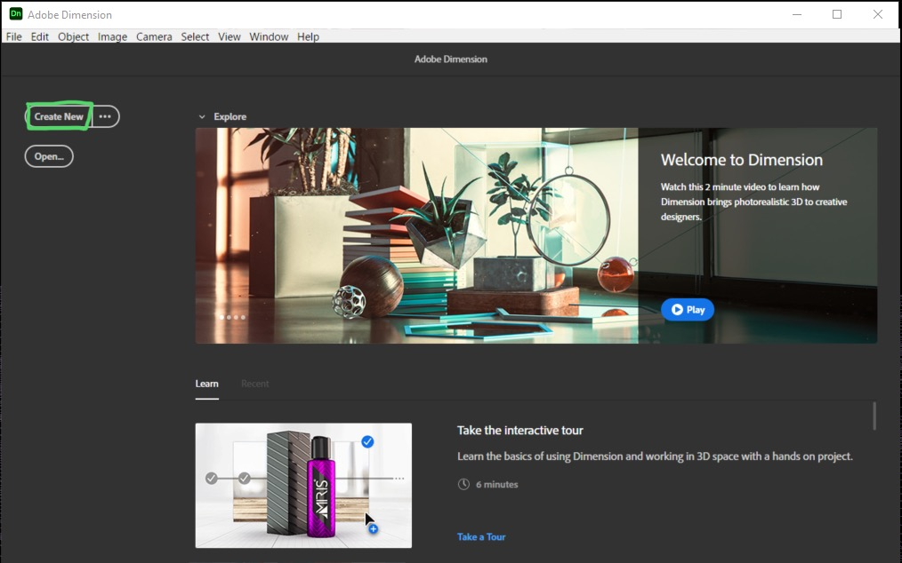
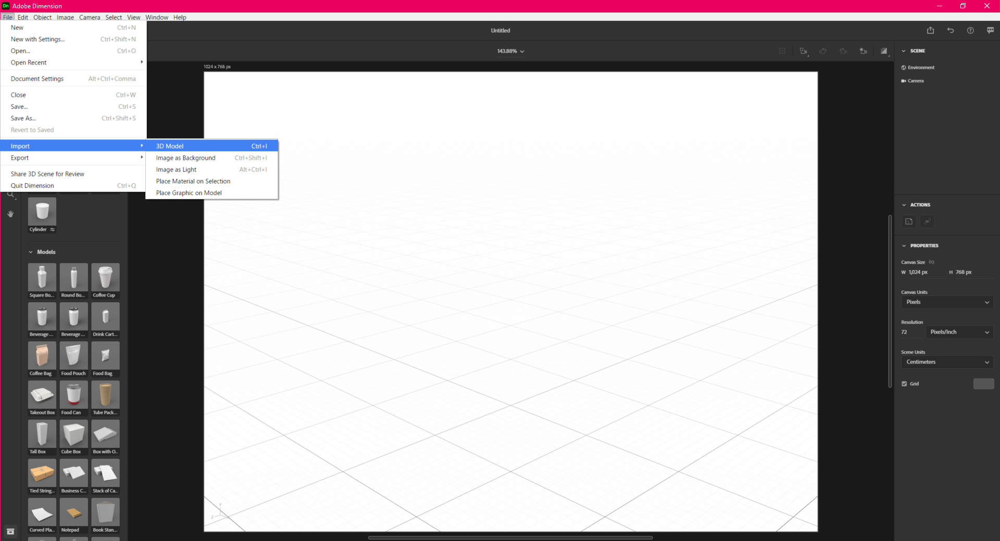
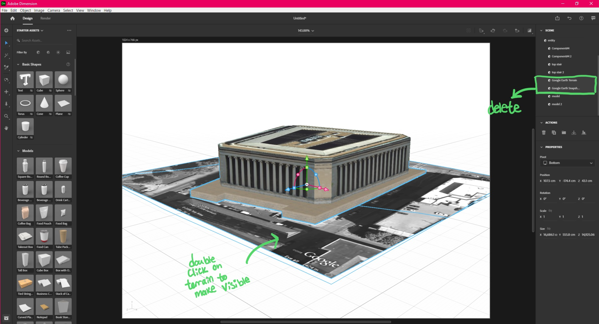
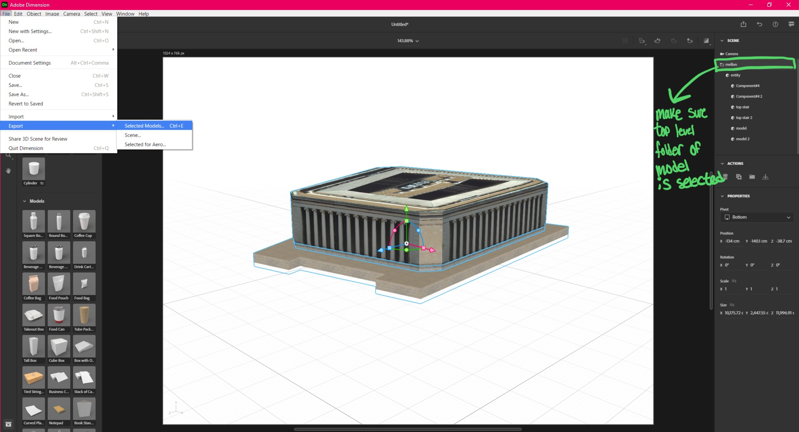
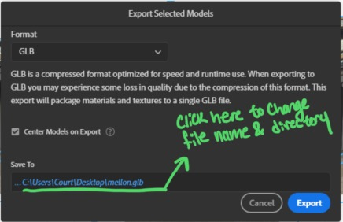

## Converting Models

Models in the ARENA need to be in the *.GLTF or *.GLB format. Most models on Sketchfab can be downloaded as GLTF models, however there are a lot of models in the SketchUp format.

# Using Adobe Dimension

To convert a model from SketchUp to GLB using [Adobe Dimension](https://www.adobe.com/products/dimension.html) (in this case, we're using Adobe Dimension 2020), first click on "Create New" in the menu.

In Dimension, there should be a blank file open now. Go to the top left to File > Import > 3D Model. Find your SketchUp model and select it.

Your model should be visible in the scene now. In some cases, like the model of a building, there will be a texture like Google Earth Terrain, which we don't want. In the scene list of objects on the upper right, even when expanded, the Google Earth Terrain isn't visible right now. Double click on the terrain under the building to make it visible in the Scene list. Now, the Google Earth objects should be visible. Select them and delete them.

Move the model or resize it however you desire. Then, in the scene list on the right, ake sure that the top level folder or object of the model is selected. Then, go to File > Export > Selected Models.

When selecting the format, select GLB, not GLTF. For some reason, the exported GLTF files from dimension don't seem to work on GLTFViewer/ARENA. You can change the name of the file and export location in "Save To". Click Export, and you're done! Now you can upload to [the filestore](https://arenaxr.org/files/) and add to the ARENA.

