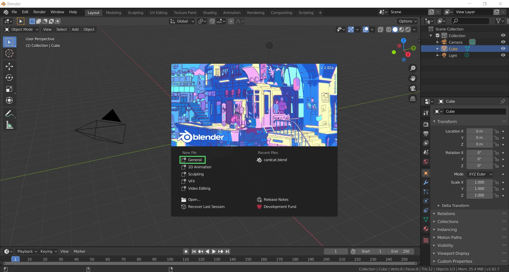
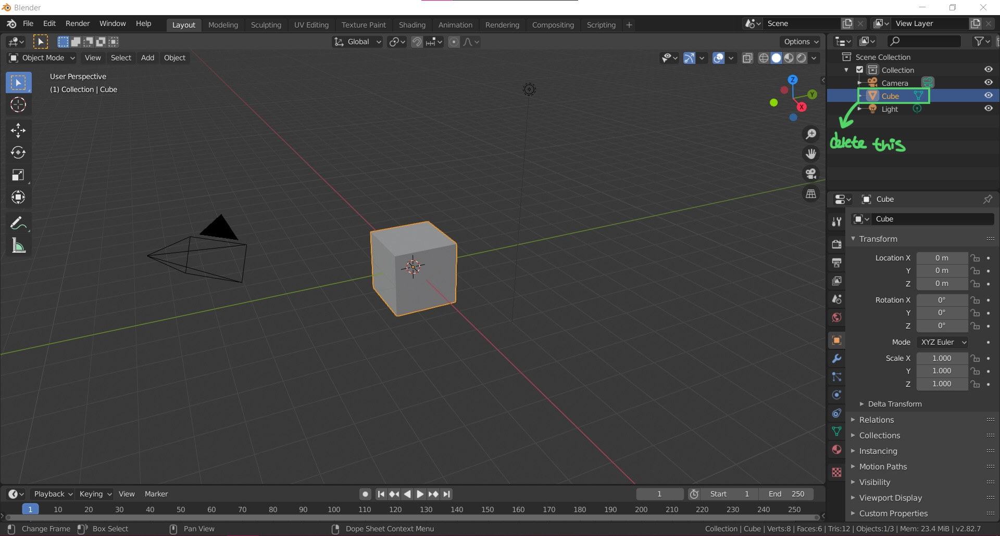
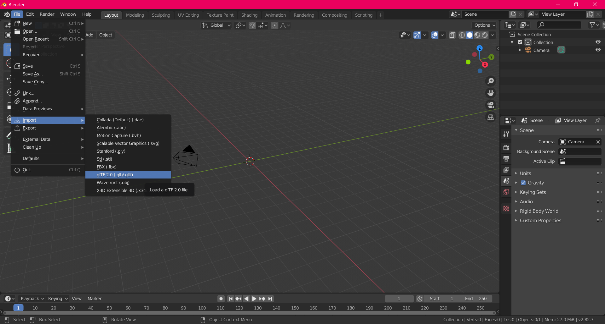
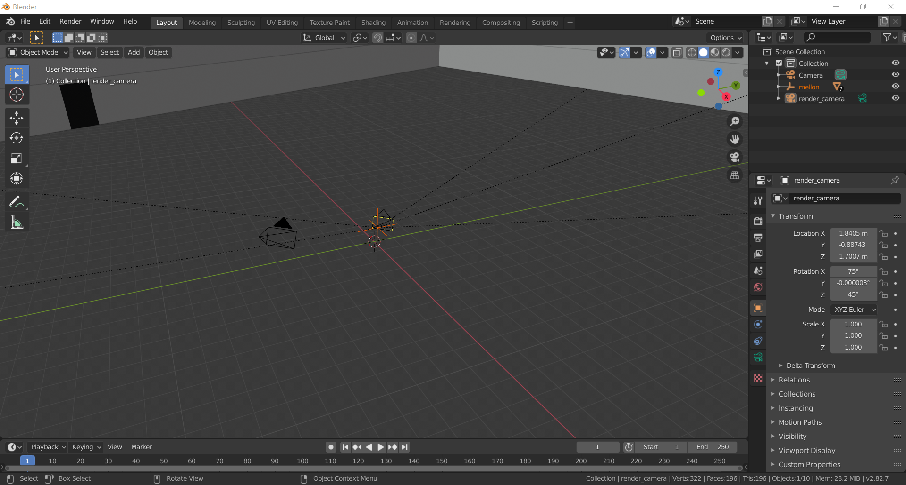
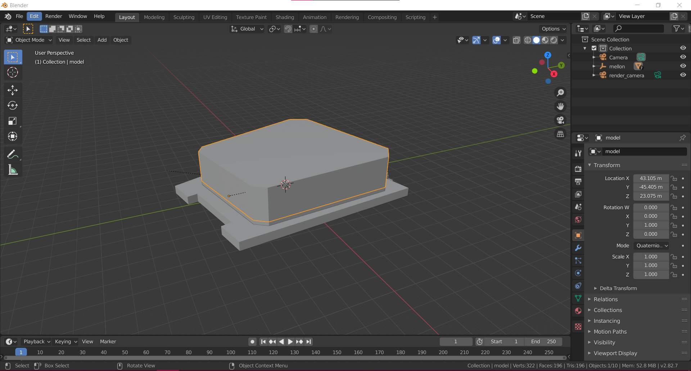
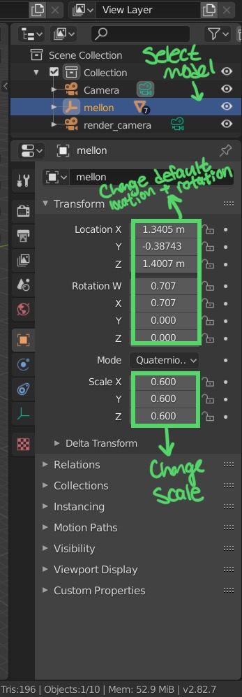
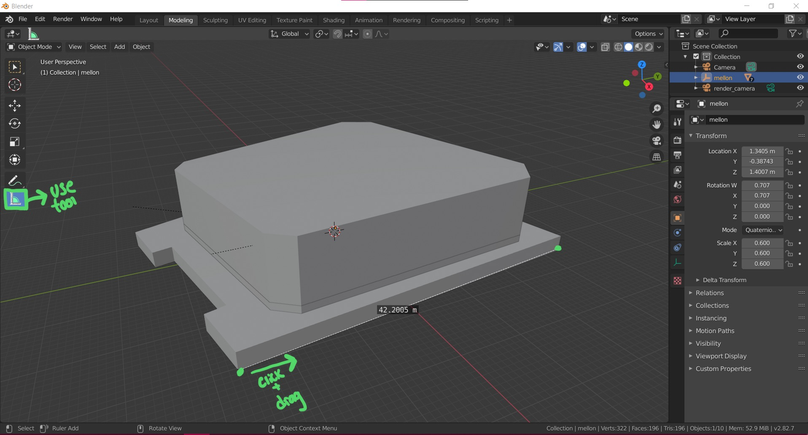
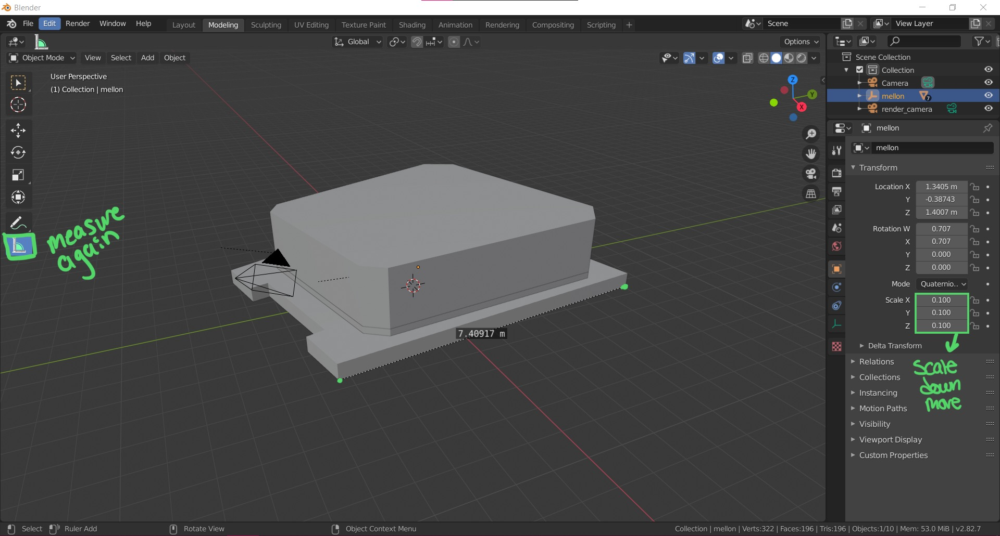

# Downscaling 3D Model Size

Some models are far too large to quickly and easily load in an online 3D space. Using Blender, you can change the size of a GLTF model easily.

## Using Blender

When you first start Blender, open a new General file.

By default, a new file will load a cube in the middle of the scene. Select the cube in the top right Scene Collection list, then right click and delete it. There will be no need for a cube here.

## Importing

Go to File > Import > glTF 2.0, and then locate your desired model. In this case, a 3d model of the Mellon Institute is being used.

## Changing Size

When you first load the model, you are inside of it. The scale of the model is massive.

Zooming out will show the shape of the model, however there are no textures on it in the default Layout tab in Blender. The textures are still linked to the model, but will not show up during this process until it is finalized and exported.

The scale of the model is currently 1, 1, 1.

In the Scene Collection window, make sure that the imported model is selected. In the Transform tab under the Scene Collection window, the location, rotation, and scale can be changed, among other things. For the time being, set the scale of X, Y, and Z to 0.6.

To get an idea of how large the model is, use the measuring tool in the menu on the left of the screen. Click on one edge of the model, and drag and release it at the end of one side of the model. In this case, the Mellon Institute scaled to 60% is still about 42 meters long, which will be huge in the ARENA.

For this model, scaling it down to 10% and remeasuring shows it is a more reasonable size.

## Exporting

Now, go to File > Export and choose to export the file as a GLTF or GLB file. The textures should scale to match the model and be applied when exporting.
