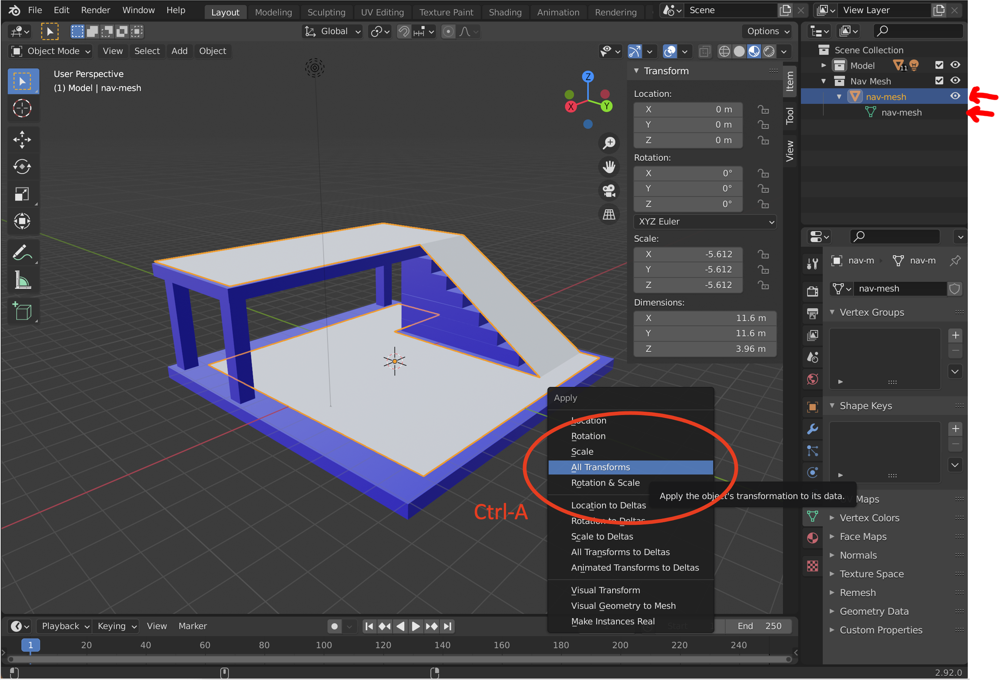

# Navigation Meshes

Navigation meshes are used to confine walking users along a surface. The surface must be a single mesh in global coordinate space contained within a GLTF file.  Unlike other GLTF files, the navigation mesh can not be scaled, moved or rotated. The mesh must also have only positive Y-axis coordinates (does not go below the ground).  In the current implementation, the starting position of the user must have a Y-coordinate that matches that corresponding (X-Z coordinate) of the mesh at the location.

## Mesh Requirements

1. Single Mesh Geometry
2. Global Coordinate Space (apply all local coordinate transforms to flatten mesh)
3. Mesh Y-coordinate must match user starting position Y-coordinate at X-Z location
4. Mesh is often transparent (not required)

## Blender Construction

These instructions will walk you through manually creating a navigation mesh.  Tools and plugins exist that can help automatically generate navigation meshes for complex scenes. First, generate a new collection for your nav mesh and generate a plane for initial construction.  ARENA has Y-axis up while Blender has Z-asis up. The plane is located at Z-axis (Y in arena) of 0.

Edit the plane to model the surface which should confine users.  It is often best to make the surface slightly smaller than the main model floor.  Use a combination of the knife tool and surface extruding to create a 3D shape.  Note that the user can only move up slanted inclines and will be blocked by any 90 degree step.

Make sure to name the nav-mesh and vertex set the same thing (i.e. nav-mesh).  Once the model is complete, convert it to global coordinates by pressing Ctrl-A and selecting "All Transforms".

Confirm that after applying all transforms, that the model is located at 0,0,0, has no rotation and has a scale of 1,1,1.  Next apply a material (BSDF shader) and set the Alpha to 0 and select Blend Mode "Alpha Clip" if you wish to hide the nav mesh.

Add the navigation mesh in the ARENA builder in the `scene-options` object as a URL to the file.

## Navmesh snapping via landmark teleports or starting positions

If a navigation mesh is properly created with the default origin in mind (0,0,0 coordinates), a user will load in to that
starting position already constrained to the navmesh. If there **is** a vertical offset, however, then the navigation constraint may
not apply unless specified with a [starting position landmark](../schemas/message/landmark). With a `landmark`
property `constrainToNavMesh` set, a teleport to landmark or starting random position can forcibly snap a user to the nearest
position on the navigation mesh.
