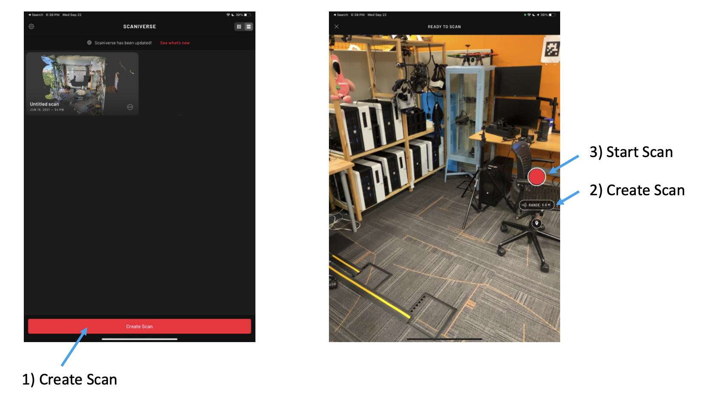
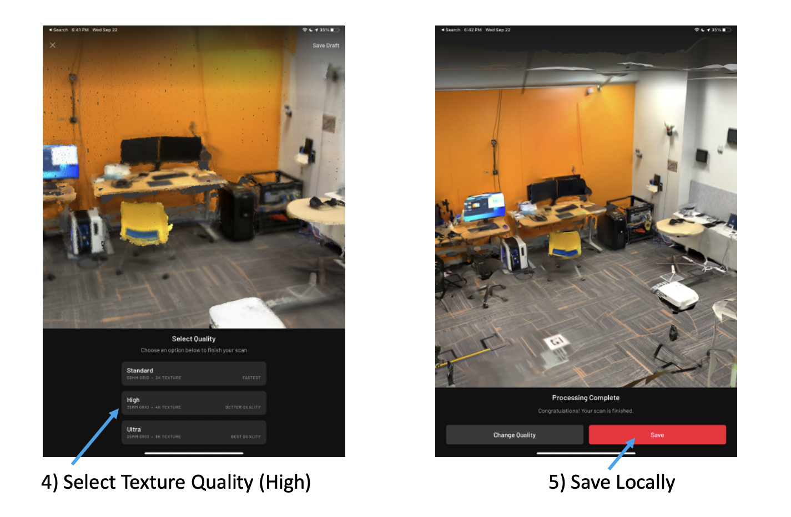
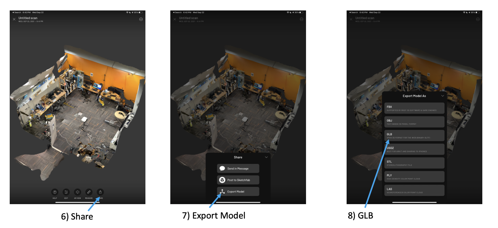

# Scanning Spaces with LiDAR iPhone and Scaniverse

[Scaniverse](https://scaniverse.com/) uses the lidar on your iPhone or iPad to generate a 3D model.

### Requirements (one of):

- iPhone 12 Pro
- iPhone Pro Max
- 2020 iPad Pro

### Scan Steps

1. Review the [Scaniverse tutorials](https://scaniverse.com/support/).
2. Download the [Scaniverse iOS software](https://apps.apple.com/app/scaniverse-lidar-3d-scanner/id1541433223).
3. Scan the room you want, and save it as a `.glb` format model. (see below)
4. Generate a scene for your model. You may use our [scene build tutorial](../overview/build.html) for pointers.
5. Upload your model to dropbox using [our suggestions](../overview/build.html#add-new-objects).
6. Review your model in the ARENA and adjust the room model's position and rotation as needed.

### Using Scaniverse

1. Open Scaniverse and click on "Create Scan".
2. Make sure the range setting is at the max (typically 5m).
3. Press the "Start Scan" button and move around the space trying to fill in the entire volume.  Slow and steady motions work best.

4. When you are done, select texture quality "High".  Experiment with different quality levels, but keep in mind that "Ultra" can lead to significantly larger model files which take longer to download and won't work as well on slower machines.
5. Save the file (sadly you can't go back and change the quality after this step)

6. Click the share button on the preview screen
7. Click export model
8. Select GLB for ARENA
9. Use airdrop or one of the other options to transfer the model to your computer.  This can be done later offline.

