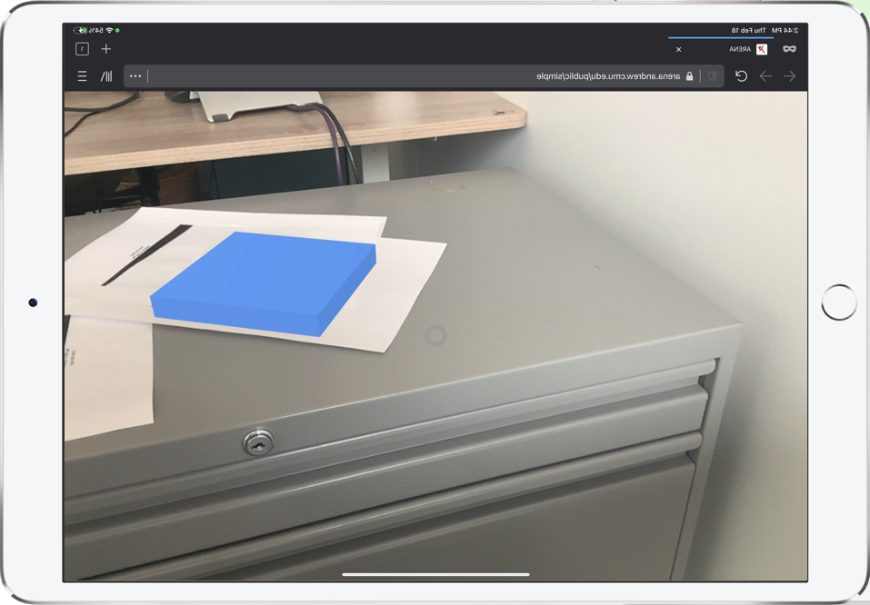
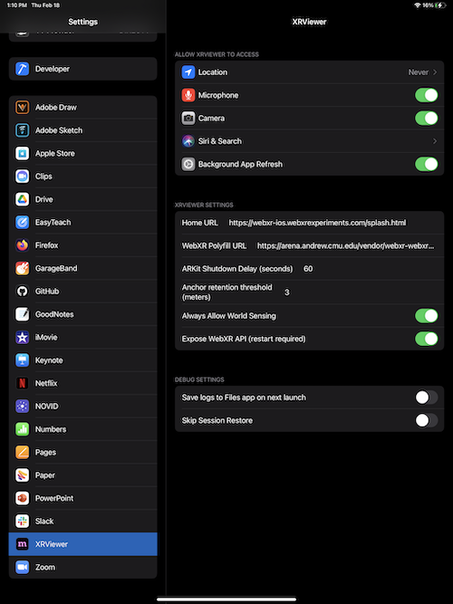

# XR Requirements

Mixed Reality experiences in ARENA require a WebXR-compatible browser, which currently includes Edge (desktop), Chrome (desktop and mobile), Firefox (desktop and mobile; not enabled by default), among others as shown [here](https://caniuse.com/webxr). Note that these include browsers that can run in many AR and VR headsets. For example, Oculus/Meta and Magic Leap's browsers are based on the open-source codebase of Chrome (Chromium) and include WebXR support.

Additionally, and to prototype the needs for future browser platforms, we are also maintaining **[XRBrowser](https://apps.apple.com/us/app/xr-browser/id1588029989)**, a custom version of Firefox for iOS (based off [WebXRViewer](https://apps.apple.com/us/app/webxr-viewer/id1295998056)). Both [XRBrowser](https://apps.apple.com/us/app/xr-browser/id1588029989) and [WebXRViewer](https://apps.apple.com/us/app/webxr-viewer/id1295998056) support ARENA's computer vision pipeline. In addition, the team used [XRBrowser](https://apps.apple.com/us/app/xr-browser/id1588029989) to experiment with other features, such as [spoof-resilient AR anchors](https://wise.ece.cmu.edu/projects/glitter.html).

Here we will describe the requirements of different types of anchors used in ARENA and the browsers that support these.

### Optical Markers

ARENA can support different optical markers: [Apriltags](https://april.eecs.umich.edu/software/apriltag), has experimental (outside the mainline code) support for [lightanchors/flash](https://youtu.be/_P01roIG93U), and more are expected to be added.

Optical Markers require support for ARENA's computer vision processing pipeline, which is supported by the custom camera access implemented in [WebXRViewer](https://apps.apple.com/us/app/webxr-viewer/id1295998056) and [XRBrowser](https://apps.apple.com/us/app/xr-browser/id1588029989), and also by [WebXR's raw camera access currently implemented in Chrome](https://chromestatus.com/feature/5759984304390144).










### Ultra-wideband (UWB)

UWB is a short-range radio technology widely used for indoor positioning.
ARENA support for UWB is still mostly experimental and under development.

## Browser Support

The following describes the browsers and settings needed to use ARENA's mixed reality capabilities.

### XRBrowser (iOS)

[XRBrowser](https://apps.apple.com/us/app/xr-browser/id1588029989) is the preferred Browser to use with ARENA in iOS. It can be installed from the [App Store](https://apps.apple.com/us/app/xr-browser/id1588029989).

This Browser is a fork of the experimental [Mozilla WebXRViewer (XR version of Firefox)](#webxrviewer-ios) that fixes several bugs and natively supports our computer vision pipeline.

### Chrome (Android, and more)

Currently (December 2021), only [Chrome Beta](https://www.google.com/chrome/beta/) has experimental support for [WebXR's raw camera access](https://chromestatus.com/feature/5759984304390144), which is required for ARENA's computer vision processing pipeline. We expect this feature to be rolled over into the stable release soon.

Make sure that the `chrome://flags/#webxr` (paste this into your URL bar) flag is enabled (by default, it should be).

### WebXRViewer (iOS)

While we recommend using [XRBrowser](https://apps.apple.com/us/app/xr-browser/id1588029989) on iOS, for those who want to use the original Mozilla version, ** you need to apply a few setting configuration updates**.

Mozilla's WebXRViewer viewer can be installed from the [App Store](https://apps.apple.com/us/app/webxr-viewer/id1295998056). After installing WebXRViewer, go to 'Settings -> XRViewer' and change:

**WebXR Polyfill URL**:  ```https://arenaxr.org/webxrios.js``` or ```https://arenaxr.org/vendor/webxr-webxrviewer-ios.js```

**Always Allow World Sensing**:```Yes```


