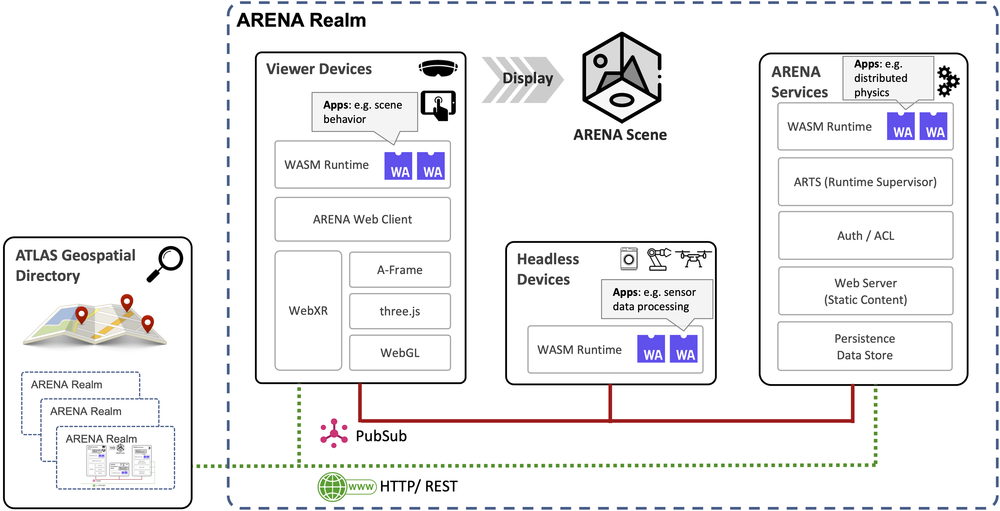
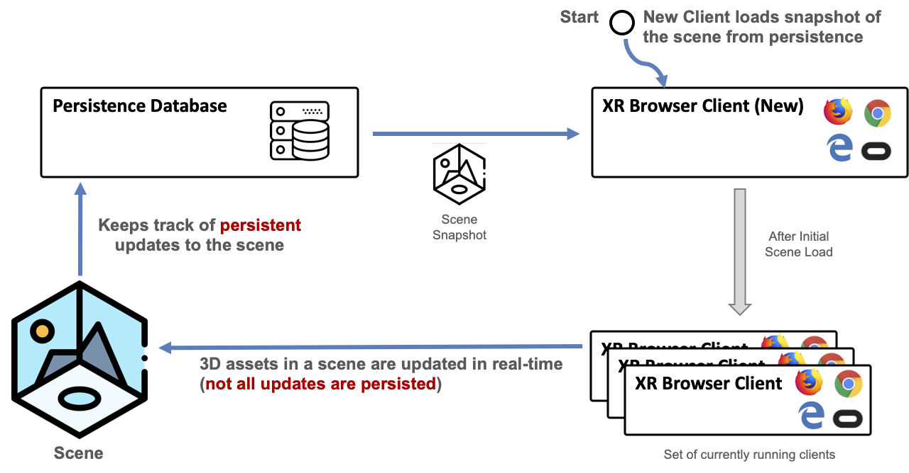
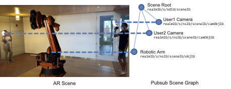

# Architecture Overview

Figure 1 presents an overview of the ARENA Architecture.



**Figure 1**. ARENA Architecture. Realms represent a geographically distinct set of resources. Each realm has its own set of ARENA services (web server, message bus, runtime manager).

A directory service, called <b>Atlas</b>, allows users to find nearby content based on coarse location and then supports managing the data needed to link <b>Scene</b> content with the physical world. As users find local content, they  are  handed  off  to  a <b>Realm</b>,  which  is  a  server  (or  group  of servers) that hosts ARENA 3D content and services. Channeling interactions through local/nearby Realms helps to improve latency-sensitive interactions. Realms connect hardware components like <i>viewing devices</i>, such as headsets, mobile phones or tablet and other <i>headless devices</i> embedded in the environment (e.g., cameras and other  sensors  used  for  localization  and  environment  awareness).Realms also include a set of <i>ARENA services</i> (message bus, content server,  persistence,  runtime manager) to support devices in that geographical area. Most services expose REST APIs to, e.g., query current state, permissions, or create access tokens.User devices connected to the ARENA can not only show 3D content, but also host hot-pluggable applications. We created a common runtime to support sandboxed code launched from any connected target. We leverage modern WebXR-capable browsers to support diverse platforms and rendering capabilities, and several existing frameworks used to create the ARENA browser client: [A-Frame](https://aframe.io/), [three.js](https://threejs.org/) and [WebGL](https://developer.mozilla.org/en-US/docs/Web/API/WebGL_API) (also shown inf Figure 1).

## ARENA Scenes

ARENA scenes include 3D content, configuration parameters, applications with shared end-points that allow users’ interactions, and information about markers that might serve as location anchors to the Scene. Scenes exist within a tree-like hierarchy with configurable access control and are often attached to a physical location. Using a web analogy, the Realm is like a (local) webserver and the Scene is like a particular web application at a URL endpoint.

### Scene Objects
ARENA  scenes  are  a  collection  of  <i>Entities</i>  to which <i>Components</i> can be attached, following [A-Frame’s Entity-Component-System (ECS) architecture](https://aframe.io/docs/1.2.0/introduction/entity-component-system.html). We support the majority of A-Frames’s primitives (e.g., geometries like boxes, circles, spheres) and components (attributes that can be attached to objects, such as position, rotation, material, sound). We also added ARENA-specific components for AR markers, programs, networked events, and options. All ARENA objects have well-defined schemas, which are the basis for the over-the-wire message format shown below (Figure 2) and are transmitted over the PubSub.

```json
{
   "object_id":"abox",
   "persist":true,
   "type":"object",
   "action":"create",
   "data":{
      "object_type":"box",
      "depth":1,
      "height":1,
      "width":1,
      "position":{
         "x":1,
         "y":1,
         "z":1
      },
      "rotation":{
         "x":0,
         "y":0,
         "z":0
      },
      "armarker":{
         "lat":40.4432,
         "lon":79.9428,
         "markerid":"1",
         "markertype":"apriltag_36h11",
         "size":150,
         "ele":200
      }
   }
}
```
**Figure 2**. Example Message and Object Definition.

All messages have an ```objectid```, ```type```, and an ```action``` (```create```, ```update```, ```delete```). Attributes in ```data``` are the object’s-specific attributes and components. The example shows a box geometry with ```depth```, ```height``` and ```width``` attributes, ```position``` and ```rotation``` components, and an ARENA-specific ```ARMarker``` component.  A [web interface developed to make simple edits to a scene](/content/overview/build.html), shows an editable scene object list, which can include scene options, programs, lights and 3D geometries and models. We imagine more advanced interfaces could be developed to create scenes, and have already some prototype editors for VR/AR.

### Scene Loading

Scenes are loaded akin to web applications within a web browser. However, unlike most standard web browsers, it is possible to simultaneously view a composition of multiple scenes without switching between tabs. In XR, a user might have access to one or more scenes in the same physical area that can be layered within an XR browser session. When the Scene is loaded, its current state is fetched from a data store service that tracks the persisted state of the Scene (see Figure 3). Compositing scenes together in a single view approximates how people naturally interact with the physical environment (as opposed to manually switching tabs).


**Figure 3**. Scene objects are first loaded from a data store service and then updated over PubSub.

### Real-time Updates
Once loaded, each of the 3D assets in a scene are then updated in real-time over the Realm’s local PubSub bus (see Figure 3). For example, if an application changes the color of a cube, this would be captured in a message over the bus. Figure 4 below exemplifies how a 3D scene is represented.



**Figure 4**. Objects in an ARENA Scene are implicitly networked over a PubSub bus, where each object is controlled by a topic end-point. The topic hierarchy is partitioned by Realm (```RealmID```), owner name space (```nsID```), scenes (```sceneID```) and objects within the scene(```camObjID``` or ```objID```).

Each object in a Scene is managed by a topic end-point on the PubSub bus, making them <i>implicitly</i> networked. When a user moves their camera or clicks on an object, these updates and events are transmitted as messages. This network transparencyallows any number of applications and users running from different devices to interact seamlessly within the 3D environment. As shown in Figure 4, users can see an avatar representation of other users in AR/VR as their camera pose is being published. See more details about the [ARENA PubSub structure](./pubsub.html).

### Access Control
Each user is given a token which defines read/write access to topics within the scene structure. This mechanism allows for very granular control over the objects in a scene. For example, we can make certain objects invisible to a user by not granting read ac-cess to that particular object in the PubSub structure. For simplicity, we currently use scenes as our basic unit of access control. We have defined two basic roles for users in a scene: editor and viewer.
