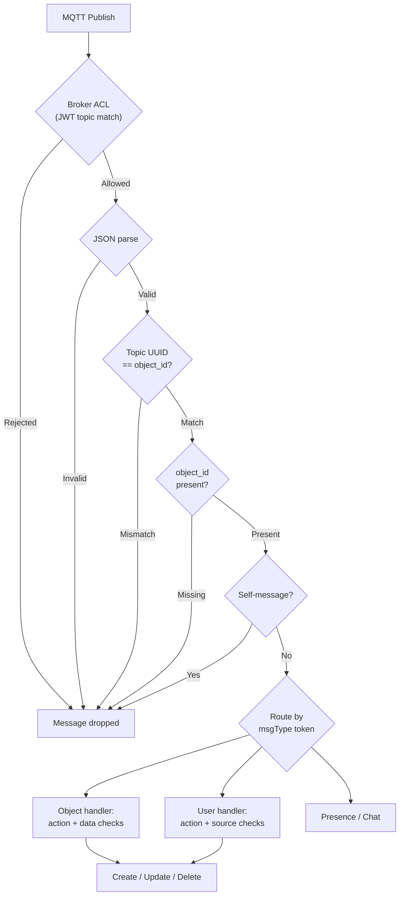

# ARENA Message Validation Reference

Reference of all checks performed on incoming MQTT messages across the ARENA stack. Used when designing message publishing systems and message consuming systems to ensure messages will be accepted and processed correctly.

Legend: ✅ enforced | ❌ not checked | ➖ N/A

---

## 1. Transport Layer — Broker ACL

JWT tokens issued by `arena-account` restrict which topics each user can publish/subscribe to.

| Rule | Failure | web-core | arena-py | arena-unity | persist | recorder |
|------|---------|----------|----------|-------------|---------|----------|
| Publish topic must contain the sender's own `userClient` at position 5 | Broker rejects publish | ✅ | ✅ | ✅ | ➖ | ➖ |
| Publish topic UUID (position 6) must be sender's own `idTag` or allowed object ID | Broker rejects publish | ✅ | ✅ | ✅ | ➖ | ➖ |
| Subscribe topics are restricted to the scene and own private channel | Broker rejects subscribe | ✅ | ✅ | ✅ | ✅ | ✅ |
| Scene editors get additional object (`o`) and program (`p`) publish rights in their namespace | Unprivileged users cannot publish to other users' object topics | ✅ | ✅ | ✅ | ➖ | ➖ |

{: .important}
> The broker is the primary security boundary. A user cannot spoof another user's `userClient` in the topic, which limits the scope of any `object_id` they can claim in the payload.

---

## 2. Message Parsing

Checks performed on raw MQTT message payloads before any semantic processing.

| Rule | Failure | web-core | arena-py | arena-unity | persist | recorder |
|------|---------|----------|----------|-------------|---------|----------|
| Payload must be valid JSON | Silently dropped | ✅ | ✅ | ❌ | ✅ | ✅ |
| Payload `object_id` must match topic UUID (position 6) | Silently dropped | ✅ | ✅ | ❌ | ✅ | ❌ |
| Payload must not be empty/null | Warned and dropped | ✅ | ✅ | ❌ | ✅ | ✅ |

{: .warning}
> The `object_id` ↔ topic UUID check is critical for security. Combined with broker ACL (which restricts which UUIDs a user can publish to), it prevents publishing messages with arbitrary `object_id` values. Arena-unity has a TODO for this check.

---

## 3. Envelope Validation

Checks on required top-level message fields.

| Rule | Failure | web-core | arena-py | arena-unity | persist | recorder |
|------|---------|----------|----------|-------------|---------|----------|
| `object_id` field must be present | Warned and dropped | ✅ | ✅ | ❌ | ✅ | ❌ |
| `action` field must be present (for object and user messages) | Warned and dropped | ✅ | ✅ | ❌ | ❌ | ❌ |
| `action` must be one of: `create`, `update`, `delete`, `clientEvent` | Warned and dropped | ✅ | ✅ | ❌ | ✅ | ❌ |
| `data` field must be present for `create` and `update` actions | Warned and dropped | ✅ | ❌ | ❌ | ❌ | ❌ |
| `type` field should be present (e.g. `object`, `scene-options`, `rig`, `camera-override`) | Warning, processing continues | ✅ | ❌ | ❌ | ❌ | ❌ |
| `data.object_type` should be present for object creates | Warning, processing continues | ✅ | ❌ | ❌ | ❌ | ❌ |

{: .note}
> Arena-unity deserializes into `ArenaMessageJson` which provides structural typing, but does not explicitly validate or reject messages with missing fields before processing.

---

## 4. Self-Message Filtering

Messages from the local client are filtered to avoid processing own state twice.

| Rule | Failure | web-core | arena-py | arena-unity | persist | recorder |
|------|---------|----------|----------|-------------|---------|----------|
| Messages from own `userClient` (topic position 5) are ignored | Silently skipped | ✅ | ➖ | ❌ | ➖ | ➖ |
| Object messages for own camera/hands/face are ignored | Silently skipped | ✅ | ➖ | ❌ | ➖ | ➖ |

---

## 5. Message Type Routing

Scene messages are dispatched by the message type token (position 4 in topic).

| Message Type | Token | Accepted Actions | web-core | arena-py | arena-unity |
|---|---|---|---|---|---|
| Objects | `o` | `create`, `update`, `delete` | ✅ | ✅ | ✅ |
| User | `u` | `create`, `update`, `delete`, `clientEvent` | ✅ | ✅ | ✅ |
| Presence | `x` | *(varies)* | ✅ | ✅ | ✅ |
| Chat | `c` | *(varies)* | ✅ | ✅ | ❌ |
| Render | `r` | *(varies)* | ❌ | ❌ | ✅ (renderfusion) |
| Program | `p` | *(varies)* | ❌ | ✅ | ❌ |
| Env | `e` | *(varies)* | ❌ | ❌ | ❌ |
| Debug | `d` | *(varies)* | ❌ | ❌ | ❌ |

Unknown message types are logged as errors and dropped (web-core, arena-unity). Arena-py skips unrecognized types silently.

---

## 6. Security Filters

Checks that prevent message-based attacks from other clients.

| Rule | Failure | web-core | arena-py | arena-unity | persist | recorder |
|------|---------|----------|----------|-------------|---------|----------|
| `clientEvent` `data.source` must match topic `toUid` (position 7) | Warned and dropped | ✅ | ❌ | ❌ | ➖ | ➖ |
| `goto-url` and `textinput` events from remote clients are blocked | Silently ignored | ✅ | ➖ | ❌ | ➖ | ➖ |
| `camera-override` messages only processed if addressed to own camera | Silently ignored for others | ✅ | ➖ | ❌ | ➖ | ➖ |
| `rig` teleport messages only processed if addressed to own camera | Silently ignored for others | ✅ | ➖ | ❌ | ➖ | ➖ |
| Client-side publish permission check before sending | Warning logged | ❌ | ❌ | ✅ | ➖ | ➖ |

{: .note}
> Arena-unity performs a client-side `HasPerms()` check against JWT publish permissions before publishing, logging any permission failures. This is advisory only — the broker enforces the actual ACL.

---

## 7. Persistence Rules

Additional checks by the persistence service for database storage.

| Rule | Failure | persist |
|------|---------|---------|
| `persist` flag must be truthy for object to be stored | Not persisted | ✅ |
| TTL expiration is only computed when `persist` is truthy | Not persisted with TTL | ✅ |
| `delete` action cascades: child objects (by `parent` attribute) are also deleted | Children removed | ✅ |
| Template containers (`object_id` with `::`) trigger regex deletion of child template instances | Template instances removed | ✅ |

---

## 8. Message Envelope Summary

```json
{
    "object_id": "required — must match topic UUID token (position 6)",
    "action": "required — create | update | delete | clientEvent",
    "type": "recommended — object | scene-options | camera-override | rig",
    "persist": "optional — boolean, enables persistence",
    "ttl": "optional — seconds until auto-delete (only effective with persist=true)",
    "data": {
        "object_type": "recommended for create — box | sphere | gltf-model | camera | ...",
        "position": { "x": 0, "y": 0, "z": 0 },
        "rotation": { "x": 0, "y": 0, "z": 0, "w": 1 },
        "...": "additional component attributes"
    }
}
```

### Topic Structure

```
realm/s/{namespace}/{sceneName}/{msgType}/{userClient}/{uuid}/{toUid}
  0    1      2          3          4          5         6      7
```

| Position | Token | Description |
|----------|-------|-------------|
| 0 | `realm` | Fixed realm prefix |
| 1 | Type | `s` (scene), `d` (device), `g` (general) |
| 2 | Namespace | User or org namespace |
| 3 | Scene name | Scene identifier |
| 4 | Message type | `o` objects, `u` user, `x` presence, `c` chat, `r` render, `e` env, `p` program, `d` debug |
| 5 | User client | Sender identity (e.g. `jdoe_1234567890_web`) |
| 6 | UUID | Object or user ID — must match payload `object_id` |
| 7 | To UID | Optional private recipient ID |

### Validation Pipeline


