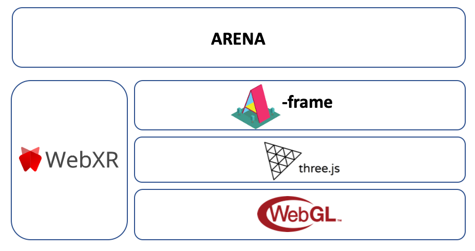

# Cross Platform Support

A core component of the ARENA is an environment to view and interact in virtual and augmented reality. ARENA leverages modern [WebXR-capable browsers](https://www.w3.org/TR/webxr/) to support diverse platforms and rendering capabilities, and several existing frameworks were used to create the ARENA browser client: [A-Frame](https://aframe.io/), [three.js](https://threejs.org/) and [WebGL](https://developer.mozilla.org/en-US/docs/Web/API/WebGL_API). This allows ARENA content to be viewed on a number of platforms ranging from standard web browsers on desktop computers and VR headsets (desktop browsers, FireFox Reality for VR headsets, Oculus Browser for VR headsets), on phones / tablets with passthrough AR (FireFox WebXR Viewer, Chrome) and wearable AR headsets (Hololens Edge Browser, Magic Leap Lumin Browser). All of these devices can interact in a multi-user manner with a consistent scene. In order to prototype the needs for future browser platforms, we are maintaining a custom Browser version of Firefox for iOS (based of [WebXRViewer](https://apps.apple.com/us/app/webxr-viewer/id1295998056)) that is able to perform local image processing as well as 3D click I/O events.

**Figure 1**. ARENA Browser Stack.
