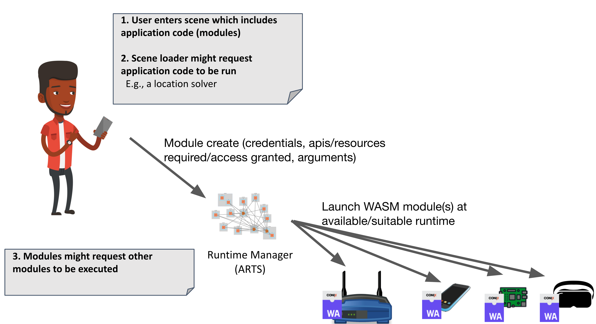

# ARENA Runtime Supervisor (ARTS) Overview

By leveraging a common runtime and carefully integrated resource monitoring, the ARENA Runtime Supervisor (ARTS) can handle very heterogenous compute resources, across compute classes, from small embedded devices to edge servers. It is distinct from several previous frameworks for managing distributed computing in that it focus on adaptation to changing resources and support for highly heterogenous distributed systems found at the edge.

ARTS is responsible for managing computational resources available in an ARENA realm (realms represent a geographically distinct set of resources; see [Architecture](../architecture/)). It uses [WASM modules](https://webassembly.github.io/spec/core/syntax/modules.html) as a basic compute unit that can run in isolation in a distributed set of available [runtimes](runtime), which run in, e.g., headsets, phones, laptops, embedded routers or edge servers. Runtimes register in ARTS their availability, resources. and system access APIs implemented.

As applications are started in the ARENA (Figure 1), ARTS decides the best available compute resource(s) to run the application and monitors its execution do adapt to changing resource availability and consumption. This execution-time adaptation is a unique aspect of ARTS that leverages an important feature: **live migration of WASM modules** (see [runtime](runtime)).

 **Figure 1**. Starting a new Application in the ARENA

See the [SilverlineFramework github](https://github.com/SilverLineFramework/orchestrator).
