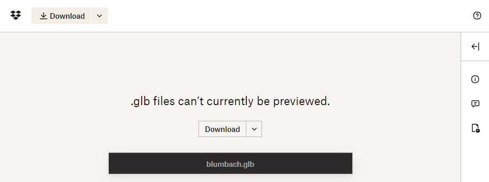

<link rel="stylesheet" href="https://use.fontawesome.com/releases/v5.13.0/css/all.css">

# ARENA File Store Storage

To add models or programs to the ARENA, they will have to be stored somewhere. The [file store](https://arenaxr.org/files/) is where most of these files are currently located, and can easily be accessed.

We only allow 3 different methods of storage currently: the ARENA File Store, CDN, and Dropbox, as follows.

- **ARENA File Store Url**: `store/users/wiselab/build/blumbach.glb`
- **ARENA File Store CDN Url**: `https://arena-cdn.conix.io/store/users/wiselab/build/blumbach.glb`
- **Dropbox Url**: `https://www.dropbox.com/s/pgytn552kzukm8f/blumbach.glb?dl=0`

## User Space

Every user automatically has space publicly available: **https://arenaxr.org/store/users/[your username]**.

## Uploading Models

Think about how you want to a user to load large files from a web browser. The answer to these questions may effect the storage methods below:
- Will this take a long time to load?
- Should you decimate your model to improve loading?
- Will you need a CDN to improve download latency/bandwidth?
- Do you want expanded storage you can purchase from Dropbox?

### File Store Upload on Build Page
This example will highlight the ARENA File Store strategy.
Select the **\[Upload Model to File Store and Scene\]** or
**\[ ↑ \]** button at the top of the [build page](https://arenaxr.org/build) .
Select the model and it will be uploaded for you automatically.

### File Store Web Interface

| After logging into the ARENA file store, there will be options to create a new folder or file on the left of the screen. You can upload entire folders or files, either by clicking the "upload" button <i class="fas fa-upload"></i> on the top right, or dragging them to the page. You can copy a filestore path or file link by opening the file or folder and clicking the copy path link button <i class="fas fa-link"></i>.|  |

Most of the 3D models are stored in the folder "models". To add a 3D model, make sure that it is in `*.GLB/*.GLTF` format, and upload the models. If it is a GLTF in a folder with multiple files, make sure to upload all of it. Keep this in mind when adding the object to a scene, as you will have to specify the GLTF file name within the folder (but not the textures or other components).

### File Store CDN

You may choose to have our CDN store the files for faster loading.
In that case, just store files paths under 'store/users/<username>' and to use CDN, prefix with `https://arena-cdn.conix.io/` (e.g. `https://arena-cdn.conix.io/store/users/wiselab/build/blumbach.glb`).

### Dropbox

In order to use it in the ARENA, we uploaded a .glb copy to dropbox and shared it publicly:
[https://www.dropbox.com/s/pgytn552kzukm8f/blumbach.glb?dl=0](https://www.dropbox.com/s/pgytn552kzukm8f/blumbach.glb?dl=0)



## Uploading Programs

To upload a Python or WASM program to the ARENA, follow the same steps as uploading a 3D model. Either create a new file/folder, or upload the files/folders with the programs.

## Additional Notes

Keep in mind the locations of your files, as you will need to know them when trying to add them to the ARENA using [the build page](/content/overview/build).
