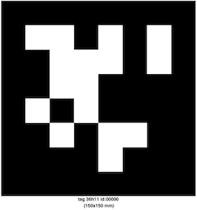

# Optical Markers

<figure class="video_container">
  <iframe width="560" height="315" src="https://www.youtube.com/embed/rU6E3LHg0aQ" frameborder="0" allow="accelerometer; autoplay; clipboard-write; encrypted-media; gyroscope; picture-in-picture" allowfullscreen></iframe>
</figure>

The ARENA can use [Apriltags](https://april.eecs.umich.edu/software/apriltag) to relocalize the device. To perform relocalization, the ARENA solver must know the pose of the tag detected, and thus tags must be registered in [ATLAS](/content/tools/atlas.html). The exception are tags with ID 0, which are assumed to mark the origin: 0, 0, 0 (x, y, z), which we detail next.



## Using AprilTag with ID 0 as a reference to the scene origin

We have a few requirements for the AprilTag relocalization to work. Please print an AprilTag with the correct ID (0) and size, and also make sure you are using an [ARKit-capable](https://www.apple.com/augmented-reality/) device with XRViewer properly configured. We are working on support for other devices, including Android. We detail these requirements next.

### AprilTag size
Apriltags used for relocalization in the ARENA must have a well-known size as the ARENA pose solver assumes the tag size from tag ID, as shown in the table.

| Tag ID Range | Tag Size (mm) |
| ------------ | ------------- |
| [0,150]      | 150           |
| [151,300]    | 100           |
| [301,450]    | 50            |
| [451,586]    | 20            |

You can find PDF files using the correct size in [this repository](https://github.com/conix-center/apriltag-gen). In particular, tag with ID 0 is [here](https://github.com/conix-center/apriltag-gen/blob/master/output/tag36_11_00000.pdf). We have seen cases where the tags were printed with inverted black/white or with the wrong size. Please make sure your tag 0 looks as follows and that the size on the printed page is correct (150x150mm).



### WebXRViewer
The AprilTag detection requires that the browser supports computer vision while in AR mode using [WebXR](https://immersiveweb.dev/). Currently, the only browser with such support is the experimental browser from Mozilla [WebXRViewer](https://apps.apple.com/us/app/webxr-viewer/id1295998056).

After installing WebXRViewer, go to 'Settings -> XRViewer' and change:

**WebXR Polyfill URL**: ```https://arenaxr.org/vendor/webxr-webxrviewer-ios.js```

**Always Allow World Sensing**:```Yes```


### Use the device in portrait orientation

The ARENA localization solver assumes that the device is in portrait orientation, and **we recommend locking the device to portrait orientation**. The picture below shows a scene with a blue box at the origin; while not visible, the blue box is overlayed on an AprilTag with ID 0.


