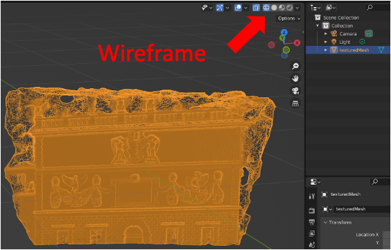
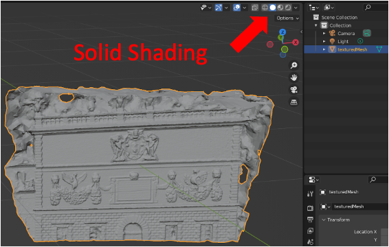
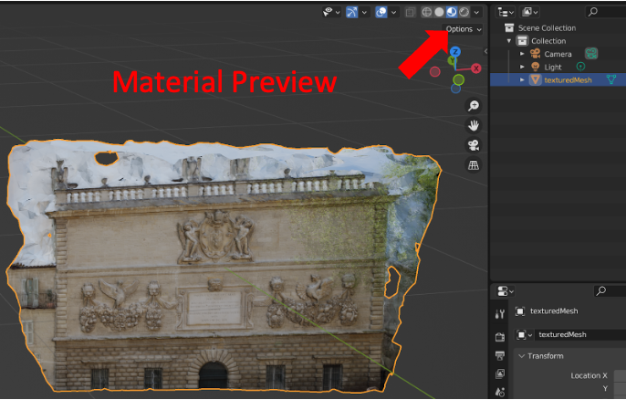
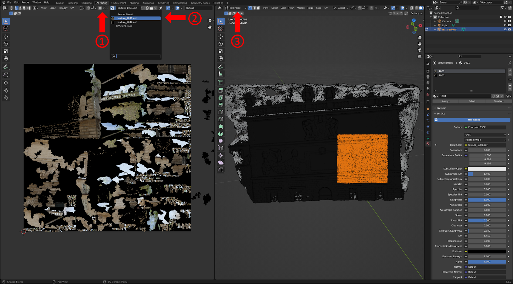
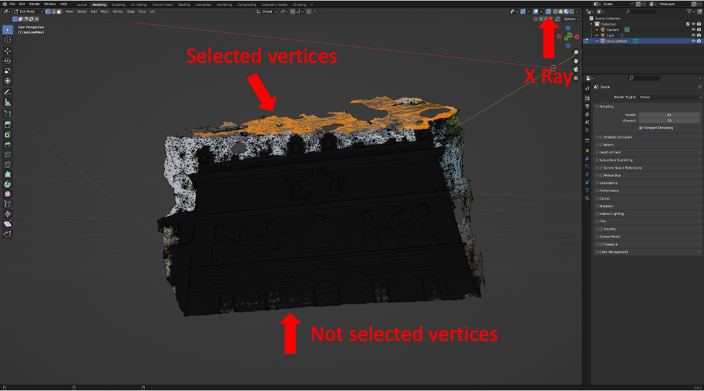
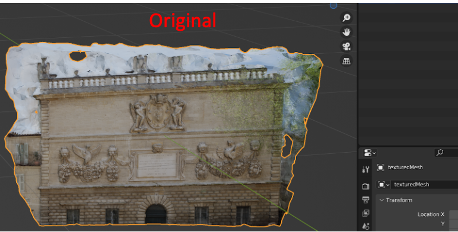
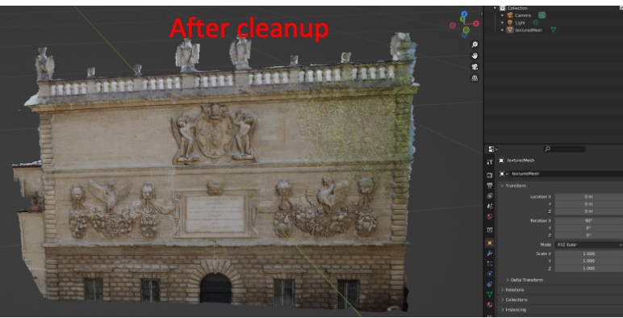

# 3D Modeling

For this part of the tutorial, you will begin using a 3D Modeling called
[<u>Blender](https://www.blender.org/), a software that is commonly
used by 3D graphics artists to create animated films (see
[<u>CHARGE](https://www.youtube.com/watch?v=UXqq0ZvbOnk) and
[<u>Sprite Fright](https://www.youtube.com/watch?v=cMxraX_5RE)).

The Photogrammetry part was mostly automated, with you tuning a few
knobs to adjust settings. Once you hit the start button, the computer
does all of the hard work. However, there are often imperfections with
the output model. The model might contain artifacts such as: floating
meshes, holes, background noises, etc. This is when Blender comes to the
rescue! We can use Blender to post-edit the model and clean up the
artifacts.

**Import your model**

To visualize your model, first locate your model save directory and
import it into Blender (File -&gt; Import -&gt; .obj). After importing
it you should see a model with no texture overlay. This is due to the
Viewport Shading mode defaults to Solid (focused on geometry features).
You can toggle between Wireframe / Solid / Material Preview / Rendered
mode at the top right corner, as highlighted in the figure below.

**UV Mapping**

One important thing to understand is the process called UV Mapping. It
involves projecting 2D images onto 3D models to create texture mapping,
one of the necessary steps for us to see textures on the mesh. We are
not going to dive into the details, but visualizing the 3D model to 2D
texture image correspondence would be helpful to comprehend the idea.

To visualize UV mapping, first click UV Editing tab on the top, second
select the texture image to view by clicking your texture image in the
drop down menu on the left panel, third select Edit Mode for the mesh.
Your interface should look similar to the one shown below.

Now, select any region in the mesh surface, observe how the
corresponding region in the texture map is highlighted as you select
different regions on the mesh.

**Model Cleanup - Removing Incorrect Geometry**

From the model visualization we can clearly see that the sky is mapped
at the wrong depth, and removing the sky will make the model cleaner and
more accurate.

The simple way to remove unwanted geometry components is to select and
delete triangle vertices / edges / faces. We can do this by going into
the Modeling tab and enabling Edit Mode. Note that if you want to select
through the entire 3D volume, not limiting to visible faces, you can
turn on the X-Ray option. After selecting the items you want to remove,
you can hit x on the keyboard to delete them.

This shows a side by side comparison of the effect of cleaning up the
geometry.


