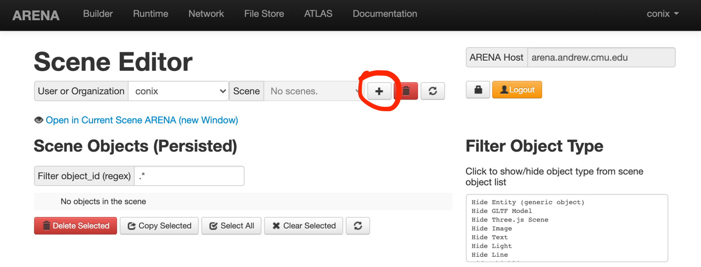

# Using the ARENA Builder

We will now do a quick tour of a simple interface to edit ARENA scenes.
We will see how to create a scene and add some content to it! 🏗️

## **Add a Scene**

Head to the build page in a new tab:
[https://arenaxr.org/build/](https://arenaxr.org/build/)

If you never created a scene, it will look similar to this:



As indicated in the Scenes select, your user has no scenes. Let us add
one by pressing the **\[+\]** button (highlighted with a circle in the
figure above). This will pop a dialog to create the new scene as
follows:

It is likely that you only have access to your User/Organization, so the
first select will have only your username. Enter the name of the scene
in the **\[Scene\]** input. You also have the choice to start your scene
with some objects copied from the ***public/default*** scene. It is a
good idea to do this, so leave it checked.

Once you are done, press the **\[Add Scene\]** button, which will prompt
a ‘Create Object create published’ popup message in the corner. The
popup will disappear in a second. Let us take this time to have a look
at a few other sections of the build page shown below:

In the figure above, we numbered (orange boxes) the following sections
of the page:

1.  **Scene selection:** Select the scene you are editing here. As we
    have seen, we can also add scenes. Additionally, we can delete a
    scene and force a refresh of the scene list. This area also has a
    logout button, and a button that allows you to check your
    permissions.

2.  **Scene Objects:** See a list of the objects currently persisted in
    the scene. At the bottom of the list there are buttons to delete,
    copy and select objects. To select a single object, click on its
    name (the line will become darker). You can press the object’s edit
    button (highlighted with a circle in the figure above) to edit its
    properties.This area also has a search bar that lets you filter the
    objects in the object list. Click on the list to toggle show/hide of
    object types.

3.  **Add/Edit Object:** This section allows editing the properties of a
    new or an existing object (by pressing the edit button in the object
    list).

Let us see the Scene Objects and Add/Edit Objects sections in a little
more detail now:

## **Editing Object Properties**

Press the **\[Edit\]** button of the **scene options** object:

You can now edit the object properties. When we are done editing the
object, we can press the **\[+ Add/Update Object\]** button to trigger an
update:



The first 4 properties of the form **(object\_id, action, persist,
type)** are common to all ARENA objects.

A **scene options** object allows setting options for a preset
environment in the scene, set some scene options (such as audio range,
publish behavior, or scene privacy) and define some renderer settings.
The properties that appear on the form can be set with the
**\[Properties\]** button.

Notice the 3 different sections of the scene options object:

The checkboxes allow to hide/show those subsections of the top-level
object (scene options). Note that each subsection has its own
**\[Properties\]** button.

For example, the environment presets:

Later, we will add a nice model to our scene. To prepare the scene for
it, try to set the environment preset to **forest**, add a point light
to the scene at(x=0, y=5, z=0), and set shadows to true:

After making the edits, update the object by pressing the **\[+ Add/Update
Object\]** button. You will have to reload the scene to have the new scene
options applied.

## **Add new Objects**

Let us try to add a new object to our scene. We will add a GLTF model of
the *Mammuthus primigenius (Blumbach)*. In order to use it in the ARENA,
we uploaded a .glb copy to dropbox and shared it publicly:
[https://www.dropbox.com/s/pgytn552kzukm8f/blumbach.glb?dl=0](https://www.dropbox.com/s/pgytn552kzukm8f/blumbach.glb?dl=0)



Start by selecting the GLTF model object type from the Type select at
the top of the Add/Edit Object section:

As you select the GLTF model, the form will change to the default properties for this object type. Let us edit the form and enter:
1. **object_id**: `blumbach` (any name that identifies the model will do)
1. **action**: `create` (creating the object)
1. **persist**: `true` (want to persist)
1. **Url**: `https://www.dropbox.com/s/pgytn552kzukm8f/blumbach.glb?dl=0` (the dropbox **share** link)
1. **Position**: 0, 1.7, -5, (x, y, z)
1. **Rotation**: 0, 45, 0, (x, y, z)
1. **Scale**: 1, 1, 1, (x, y, z)

In order to have nice shadows from our model, add a shadow property to
the GLTF
model:

And enable both cast and receive shadows:

Update the object by pressing the **\[+ Add/Update Object\]** button.

Now, if you open the scene in your browser by following the link at the
top of the page:

You should have a magnificent *Mammuthus primigenius (Blumbach)* in your
scene!



## Add Landmarks

A list of Landmarks is shown from the button at the bottom left corner of the screen
{: .btn .mr-4}.

Landmarks allow you to jump to certain places of interest in a scene. If you copied the landmarks from `scene/public`, it is likely that you have a single landmark pointing to a *Screenshare*:

Let us add a landmark to the Mammuthus primigenius (Blumbach) model. This way, wherever we are in the scene, we can quickly jump to be near it. Start by selecting the existing Mammuthus object from the list.

Update the object by pressing the <button type="button" name="button" class="btn btn-blue fs-3">**+** Add/Update Object</button> button.

Under the **GLTF Model Data** section, click on the <button type="button" name="button" class="btn btn-blue fs-3">Properties</button>, and check/add
the [`Landmark` property](../schemas/message/landmark). Add the `label` "Mammuthus primigenius (Blumbach)".

The landmarks list will automatically update once this property is added.

Now in the landmarks list and press the 'Mammuthus primigenius (Blumbach)' entry.



## See your scene in Augmented Reality (AR)

In an AR device (e.g, an AR headset or a tablet or mobile phone with passthrough AR capabilities), you can press the <button type="button" name="button" class="btn fs-3 ">AR</button> button at the bottom left (the AR button is not visible in devices that are not AR capable, such as a desktop). It will initiate an AR session where the background environment is hidden when entering AR (this is the default setting, but might vary depending on the configuration of your scene).

Your scene's origin will be placed relative to your device's location in the real world when the AR session starts. Usually, you will want to anchor your scene in the real world. The [following overview section](/content/overview/xr) has a quick AR example showing how to anchor a scene in the real world. **Check our section on [miXed Reality (XR) Experiences](/content/xr/) for details on this and other aspects of creating AR experiences in ARENA.**



Icons made by <a href="https://www.flaticon.com/authors/smashicons" title="Smashicons">Smashicons</a>, <a href="https://www.freepik.com" title="Freepik">Freepik</a> from <a href="https://www.flaticon.com/" title="Flaticon">www.flaticon.com</a>
  {: .fs-1 }
