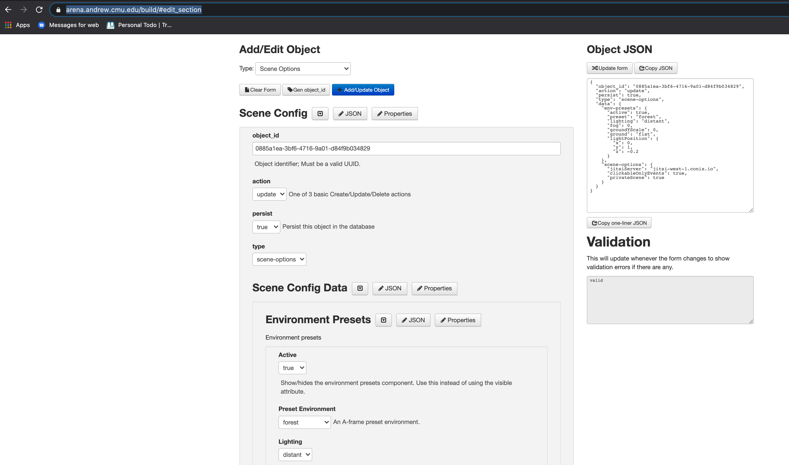

# Build ARENA Build Page



The [build page](https://arena.andrew.cmu.edu/build) in the ARENA allows you to see the current scenes and their contents, as well as adding and editing the objects inside.

[add basic build stuff here]

## Add a Basic 3D Object

## Removing Objects

## Adding a 3D Model Using the Scene Editor

To add a 3D model to a scene, make sure that it is stored on the [file store](https://arena.andrew.cmu.edu/storemng/) first. Under Add/Edit object, make sure that Type: "3D Object" is selected. Under the 3D Object header, enter a name for the object (typically a human-readable name, however you could also generate a UUID if desired). Make sure that "create" is selected under the action. Set persist to either true or false, depending on your preferences. Next to the 3d Object Data header, click on "properties" and make sure that "URL" is checked. This will ensure that you can add a URL attribute to the object, which is necessary for loading a model. The object type for a 3D model is gltf-model. You can alter the position, rotation, and scale in these attributes.

[add URL info]

## Adding and Running a Program using the Scene Editor

[Python App Upload Walkthrough](../arts/python)

## Adding Scene Options

- [JSON Scene Options Definition](../messaging/definitions.html#env-presets-object)

## Link your scene to the physical world
You can make a scene you create linkable to the physical world by adding its coordinates to the [ATLAS tool](https://atlas.conix.io) (requires write permission to list coordinates). This will allow users in Augmented Reality (AR) to [discover your ARENA scene](../tools/atlas) when they are in physical range of it.

  

  ## Edit in Scene Builder

  Let's take a look at what we've just saved in our [Scene Builder](https://arena.andrew.cmu.edu/build) tool. From here, you can also create/update/delete ARENA objects.

  Select the `example` scene in the scene list and you will see that the `duck_1` object we used with persistence has been pulled out of the persistence DB to be listed here. Now, click on the edit button icon to the right of the `duck_1` model in the Scene Objects list. Notice that the Object JSON section in the right column has the full JSON you originally submitted.

  Here you can change the position of the Duck model, for example, easily to anything you wish.

    

  ## Store Your Program in the ARENA
  You can use the ARENA RunTime Supervisor, [ARTS](../arts), to run your Python program in a scene without using the Python command-line. The general steps are:
  * Upload a Python program to the [File Store](https://arena.andrew.cmu.edu/storemng).
  * Edit your scene in the [Scene Builder](https://arena.andrew.cmu.edu/build), to add your program object from the File Store.
  * Monitor your program's runtime in the [ARTS GUI](https://arena.andrew.cmu.edu/arts).

  In more detail, there are step by step instructions to run your Python program like this in the [Scene Edit/Program Launch Example](../arts/python).

  ## Debug your program in ARTS
  Once your program is running, use the [ARTS GUI](https://arena.andrew.cmu.edu/arts). You can select your program from all the [ARTS Modules](../arts) in the tree graph. After selecting your program, on the right side, you can monitor the WASM or Python module's `stdout` logging, migrate the module to another scene, remove the module completely, and perform other maintenance.

    
