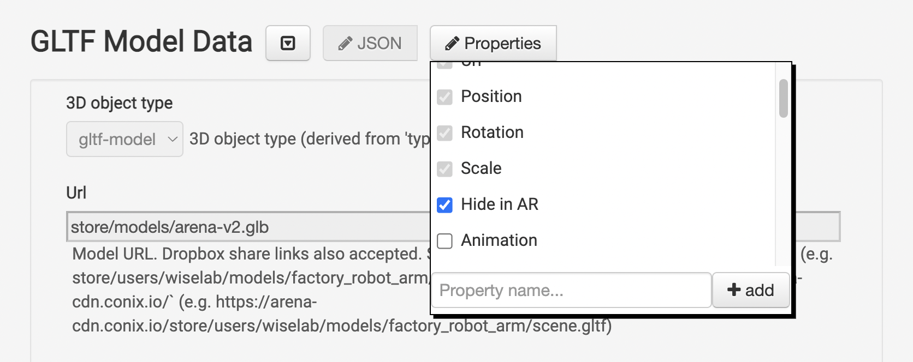

# Create a Digital Twin in the ARENA

## Scan a Model of Your Room
- use origin apriltag
- [origin apriltag](../../content/overview/localization.html#using-april-tags)
- avoid other people/movable objects in scene, pets
- monitors/screens dark
- turn on lights and lamps
- daytime, night (window captires)
- scaniverse, or perhaps matterport
- size of room matters
- size of model matters
- [scaniverse](../../content/3d-content/scaniverse)
- [photogrammetry](../../content/overview/photogrammetry)
- [matterport](../../content/3d-content/matterport)

## Import Your Room Into the ARENA
- def: build page, unity
- rotate/elevate: build, unity
- test in AR mode, make sure model lines up to apriltag and other landmarks

## Twin Programming
- videospheres
- mirror portals
- rendering data, text, contrast, suggest text color, arenaui themes


