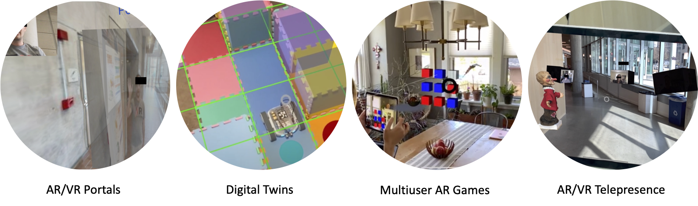

## Background

Many have predicted the future of the Web to be the integration of Web content with the real-world through technologies such as augmented reality. This overlay of virtual content on top of the physical world, called the Spatial Web (in different contexts might be called AR Cloud, MetaVerse, Digital Twin), holds promise for dramatically changing the Internet as we see it today, and has broad application.

However, building pervasive mixed (virtual and augmented) reality applications is challenging for several reasons. First, applications require global instant-on localization and anchoring to the physical world. Second, supporting interaction across multiple users and with physical entities leads to tight latency requirements. It is extremely noticeable when physical and virtual objects don’t correctly track each other. Third, support of content across platforms needs to span a wide range of compute and interaction capabilities. For example, click inputs look different on a tablet and an AR headset. Applications might need to be hosted on the cloud, at the edge or perhaps even in the end devices. Fourth, applications require access control to compute, sensor and actuator access in potentially untrusted environments. Finally, authoring and programming workflows need to adapt to real-world input and potentially interface with other Internet connected systems.

The Augmented Reality Edge Networking Architecture (ARENA) was designed to address many of the challenges of building collaborative mixed reality applications.
{: .fs-5 .fw-300 }

See a summary of the main features in the [introduction](/index.html#key-features).

We also have a more detailed description of the [ARENA architecture](/content/architecture/index.html).

## Main Concepts

Below is an overview some important ARENA concepts. We explain the idea of an ARENA <b>Realm</b>, <b>Scene</b>, and the geographic content lookups made by <b>ATLAS</b>. Along the way, we will also try to understand the role of some important ARENA system services, such as the <b>persistence service<b>.

### ARENA Realm

A Realm is a group of coordinating services including web servers for static content, an MQTT Publish-Subscribe (PubSub) messaging bus for real-time data distribution and a resource manager that can dispatch ARENA applications. The Realm defines a local instance of the ARENA along with any programs, devices or users that connect to the same PubSub bus.

Realms (and scenes) are found through geographic lookups made to ATLAS.

### ARENA Scene

A Scene is an abstraction that contains a group of related virtual assets like 3D objects, configuration parameters, applications with shared end-points that allow users interactions. Scenes exist within a tree-like hierarchy, with configurable access control and are often attached to a physical location. Using a web analogy, the Realm is like a (local) web server and the Scene is like a particular web application. Scenes are loaded similarly to web applications within a web browser with the capability to render the content and interact with location services. However, unlike most standard web browsers, it is possible to view a composition of multiple scenes simultaneously. For example, in a public space there might be multiple scenes that each contain various applications (and other users). A user might have access to one or more scenes in the same physical space that can be layered with an XR browser session. Since a Scene is the most basic unit of access control, this can be used to enable read and/or write to particular assets. Users are provided with access tokens that define their read and write access within the Scene structure.

#### Scene Loading

It is important to distinguish how scenes are loaded and subsequently updated in real-time:

Once a user connects to a Realm and loads a particular Scene, a browser is given all of the 3D objects that are within the scene. This content is initially requested from a Persistence Data Store that tracks the latest state of any persistent objects (not all objects need to be persistent).

#### Real-time Networked Updates
Once loaded, each of the 3D assets in a scene are then updated in real-time over the Realm’s local MQTT bus.  For example, if an application changes the color of a cube, this would be captured in a message over the bus. When a user moves their camera or clicks on an object, these updates and events are also transmitted as messages. Each object in a Scene is managed by an end-point on the PubSub bus making them implicitly networked. This network transparency allows any number of applications and users running from different devices to all seamlessly interact within the 3D environment. Users can even see an avatar representation of other users in AR/VR since their camera pose is continuously published into a scene.

### ATLAS - Geographic Content Lookup

Scenes and Realms can be registered and discovered with a geographic database system called ATLAS. ATLAS operates in a hierarchical manner much like the Internet’s Domain Name Service (DNS), but using GPS coordinates and UUID markers instead of domain names. ATLAS stores a GPS location for each Scene along with a 3D bounding polygon. For example, a user could read a BLE beacon that provides a UUID that maps to a GPS coordinate along with any Scenes available at that location.

It is worth noting that a Scene’s address can be used to form a URL for virtual environments that have no physical location without the need for ATLAS.

### Runtime Management (ARTS)

Execution of applications in a Scene is managed by a local resource manager (ARTS) that is also part of the Realm. ARTS is responsible for dispatching, monitoring and migrating for execution of programs to available runtimes.

# Next Steps

You can learn the basics of the interface and [enter an ARENA scene](/content/overview/user-guide.html). Also learn about [building scenes](/content/overview/build.html), and how to develop [python programs](/content/overview/dev-guide.html) to define the behavior of your scenes.
You can also see a more detailed description of the [ARENA architecture](/content/architecture/index.html).

[   First Time in the ARENA ](/content/overview/user-guide.html){: .btn .mr-4  .intro-button}
[   Build a Scene ](/content/overview/build.html){: .btn .mr-4 .intro-button}
  
[   Develop Python Programs ](/content/overview/dev-guide.html){: .btn .mr-4  .intro-button}
[   ARENA Architecture ](/content/architecture/index.html){: .btn .mr-4  .intro-button}

Icons made by <a href="https://www.flaticon.com/authors/smashicons" title="Smashicons">Smashicons</a>, <a href="https://www.freepik.com" title="Freepik">Freepik</a> from <a href="https://www.flaticon.com/" title="Flaticon">www.flaticon.com</a>
{: .fs-1 }
