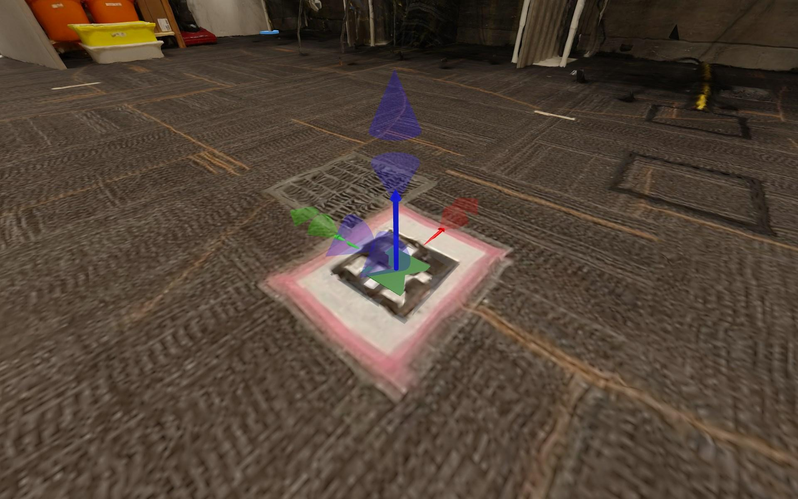

# XR Localization for ARENA

ARENA has seamless support for a spectrum of experiences, from
completely immersing the user in a digital world (Virtual Reality; VR)
to enhancing the real world with interactive digital content (Augmented
Reality; AR). A spectrum often identified as miXed Reality (XR). Try the
following for a quick sample of AR using ARENA by opening a pre-made
scene and anchoring it in the real world with an optical marker.

**Using April Tags**

Modern phones and tablets support pass-through augmented reality (AR)
with 3D digital content overlaid on top of back-facing camera
backgrounds, enhanced with built-in accelerometer, gyroscope and other
sensors to track relative motion of viewing devices.

*(Google’s AR framework
[ARCore](https://developers.google.com/ar) runs on devices with
Android version 7.0 API level 24 or above, and Apple’s AR framework
[ARKit](https://developer.apple.com/augmented-reality/arkit/)
runs on devices running iOS version 11.0 or higher.)*

If you are using an iOS device to view AR content, download the **[XR
Browser](https://apps.apple.com/us/app/xr-browser/id1588029989).**

If you are using an Android device, you can use [**Google Chrome for
Android**.](https://play.google.com/store/apps/details?id=com.android.chrome&hl=en_US&gl=US&pli=1)

To view an ARENA scene in augmented reality (AR) mode, enter the URL of
the scene using the correct browser, allow the necessary permissions and
tap on the \[AR\] button on the lower right side of the screen.

*(Landscape mode works best for AR mode. Only use Landscape in XR
Browser)*

True immersive mixed reality content requires accurate positioning of 3D
content anchored to the real world environment. ARENA natively supports
real-world anchoring of 3D digital content with **AprilTags**, which are
black and white square-pattern markers easily recognized by cameras to
gain position and rotation relative to the marker.

Print out this PDF of the [default “zero”
AprilTag](https://github.com/arenaxr/apriltag-gen/blob/master/output/tag36_11_00000.pdf),
and place it on the floor.

*(Or, print this page out. The default “zero” April tag is pictured
below:)*

*Note: more AprilTag markers can be found here:*

*[https://github.com/arenaxr/apriltag-gen/tree/master/output](https://github.com/arenaxr/apriltag-gen/tree/master/output)*

To test AprilTag localization, enter this scene:
[https://arenaxr.org/public/artest?armode=true](https://arenaxr.org/public/artest?armode=true)

*Optionally, you can also enter scenes with a QR code instead of
manually typing the link in the browser search bar:*

Now, using ARENA on a mobile Android or iOS device in AR mode, look at
the marker so that it is in full view of the camera, and watch as the 3D
digital content’s origin anchors itself correctly to the AprilTag
marker.

More info about AprilTags and ARENA setup here:

[https://docs.arenaxr.org/content/overview/xr.html](https://docs.arenaxr.org/content/overview/xr.html)

**Using the VR Calibrator**

Virtual Reality (VR) headsets can also be anchored into the scene. Note:
not all VR headsets natively support AprilTag anchoring (**including
Meta headsets**), so we have an alternative for manual calibration. This
calibration allows you to manually align the virtual world to the
physical world.

VR scene calibration currently requires connecting and running a python
script to the scene being viewed in virtual reality.

First, if you have not done so already, follow the instructions in the
Python setup and install the ARENA-py library.

pip3 install arena-py

Clone the arena-py repository on github to gain access to all of the
examples and utilities:
[https://github.com/arenaxr/arena-py](https://github.com/arenaxr/arena-py)

Inside this repository, change the directory to
*arena-py/tools/calibrate-vr*. Here, there is a python script named
“calibrate.py”. Run the following command in a terminal or command
prompt:

python calibrate.py -mh arenaxr.org -n username -s scenename

The following parameters should be changed to reflect your scene:

-mh arenaxr.org (do not change this)

-n username (change this to your username)

-s scenename (change this to your scene name)

Now, in your VR headset, use the default **Browser** app, and open the
scene of interest (the same scene as you set the python VR calibrator
script to). When the scene has loaded in your VR browser, enable the
necessary permissions and click on the \[AR\] button on the lower right
hand side of the ARENA page.

*Pictured above: Oculus Quest Pro browser view.*

While the Python calibrator script is running, you will see two big
colored buttons: a **green triangular “Play” button** and a **red
octagonal “Stop” button**. Press the green button to begin VR
calibration.

When the big green button is pressed, a multi-axis calibrator gizmo will
be visible.

Use the VR controller to repeatedly click on the gizmo’s eight buttons

(move x+, move x-, move y+, move y-, move z+, move z-, rotate y+, rotate
y-)

until the multi-axis VR calibrator gizmo is aligned with the AprilTag
marker.

When you are done aligning the multi-axis VR calibrator gizmo with the
April Tag, click on the big red octagonal “Stop” button to hide the
calibrator gizmo and lock it in place. If the calibration drifts too
much, simply click on the green button to recalibrate. Note that
recalibration will likely be necessary every time the browser is
refreshed.


