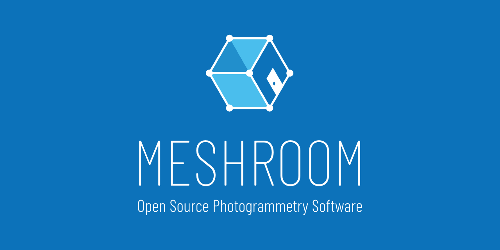
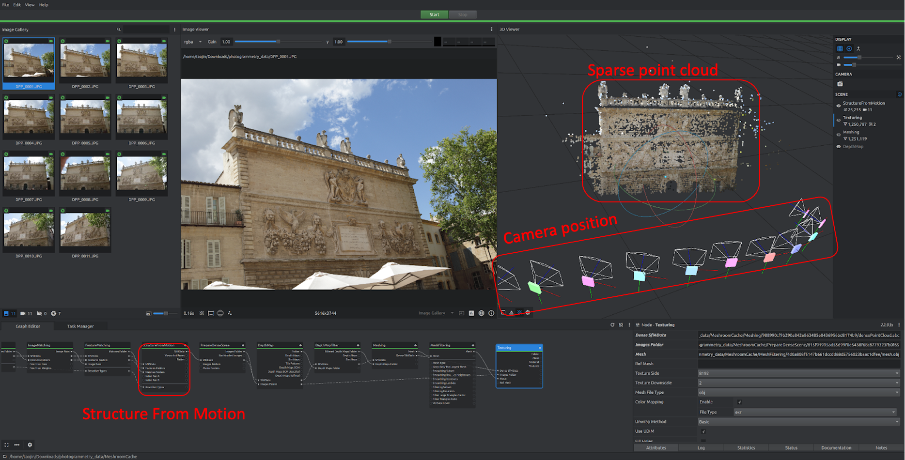
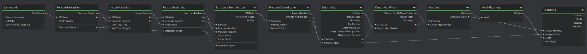

**Photogrammetry**

In this section of the lab, you will construct a 3D model of a real
world object using a technique known as photogrammetry.

Photogrammetry estimates the 3D geometric properties (such as shape,
size, and positions of objects) of an object from 2D images taken from
different perspectives. While this might sound like magic, it is based
on well-established physical principles. These principles, at a high
level, span:

-   How camera captures light and projects it onto image sensor

-   Algorithms that inferring camera spatial location at the time when
    images were captured

-   Depth estimation from 2D images sequences

-   3D model reconstruction from color and depth information

This lab will provide practical experience using photogrammetry, you
will learn more about the details later in the semester.

**Setting up your workflow**

Download [<u>Meshroom</u>](https://alicevision.org/#meshroom), along
with this
[<u>dataset</u>](https://drive.google.com/file/d/1TXwt8oSllGSJLj8Z6-y1i0yqj81JxM_v/view?usp=sharing)
to a Linux / Windows computer that has an Nvidia GPU.

After opening Meshroom and loading the dataset, you should see an
interface as shown below. The key thing to notice is the *Graph Editor*
panel located in the bottom left. This panel describes individual steps
that photogrammetry involves. To get to know the purpose of each step,
read [<u>this</u>](https://alicevision.org/#photogrammetry/) nice
writeup.

Now, click start to generate your first 3D model. This will take several
minutes or more depending on the compute power of your machine. After
it’s finished, you should see sparse 3D point cloud shown in the 3D
viewer panel:

If you look closely at the Scene section in 3D Viewer, you’ll find this
is actually showing sparse point cloud and estimated camera position
generated from *Structure From Motion* step (one of the blocks in Graph
Editor), we can toggle the *eye icon* to show/hide this view.

In fact, we can view output from many different steps in the viewer.
Double clicking any blocks from Structure From Motion to Texturing will
visualize the result. The final 3D model is generated at the Texturing
step.

To access the final output files, right click on the Texturing node and
select Open Folder. You’ll find one OBJ file that contains the 3D model,
two EXR files that represent texture maps, and one MTL file that
describes how the model and texture files link to each other.

**Capture your own model**

Now that you have reconstructed a model from the dataset, it’s time to
collect your own data to build a model. All you need is to take images
from multiple views (make sure there’s enough overlapping view between
images) and re-execute the same workflow. Try to scan a real world
object that has some animate-able features, as you will be adding
animations to this scan later on.

This time, instead of running the pipeline only with default parameters
in the nodes, explore how adjusting different parameters impacts the
model quality. The knobs that might be of interest is:

-   Texturing: Texture Size, Texture Downscale

-   Mesh Decimate (right click to add this node): Simplification Factor

Make sure you have a good-looking and **<u>complete</u>** scan (it's ok
if there are some holes/artifacts, we will fix those later). You will be
using this model for the rest of the semester in various labs, so create
a virtual model you are proud of!!
