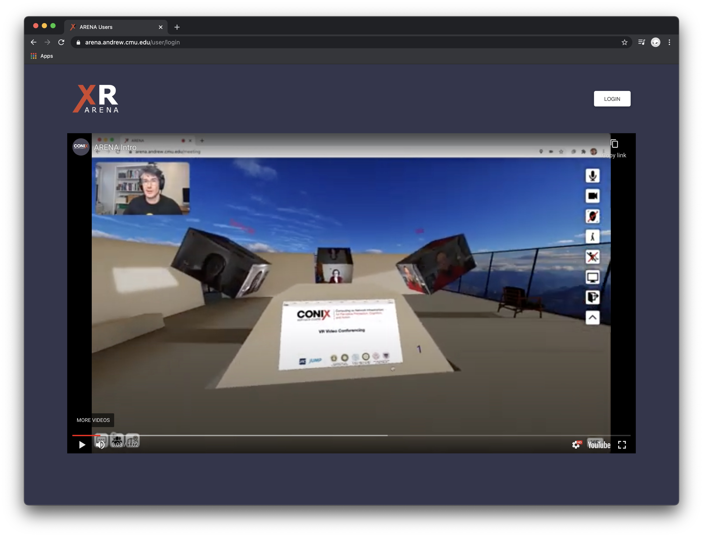
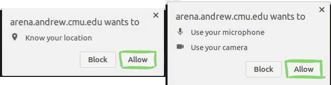
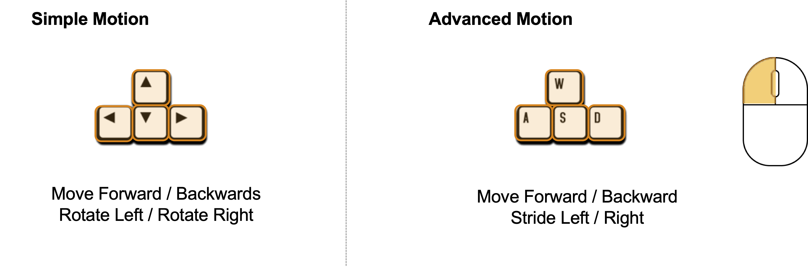
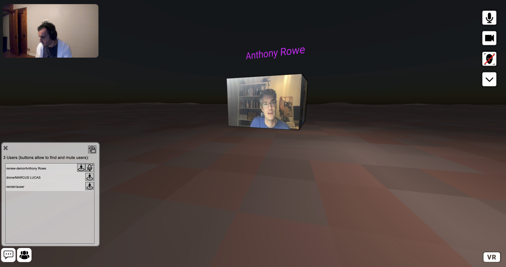
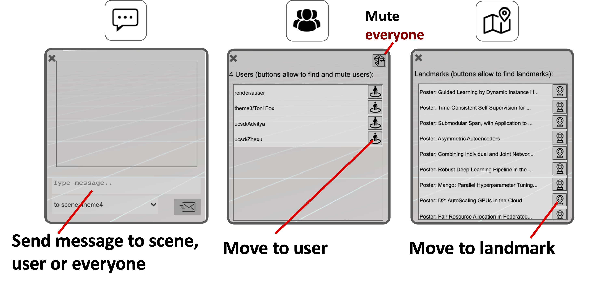

# Entering ARENA for the First Time

This walkthrough of the ARENA interface will show the main features of the ARENA when used in Virtual Reality (VR).

## Before you Start

For the best ARENA performance, you need a couple of things:
- **Chrome or Edge Web Browser** (FireFox also works, but sometimes FireFox doesn’t send video)
- No ad blockers (some blockers are okay, others cause issues)
- **Headphones highly recommended**. They provide directional sound and stop echo. Please stay on mute when not speaking if you don’t have headphones.
- A fast machine to handle all the processing and 3D graphics is also recommended

## Opening a Scene

Let us have a look at the **lobby** scene: [https://arenaxr.org/public/lobby](https://arenaxr.org/public/lobby){:target="\_blank"}.

The link above will open in a new tab. Since ARENA is a collaborative, multi-user environment, you may see other people there. Say Hi!



## Signing In

When you first enter the ARENA, there will be a screen asking you to sign in. You can use your Google account, which will automatically set your name to the name used in your Google account (you can change this later).





### ARENA Username

If you choose to login using your Google account, you will be asked to signup and define your arena username:


This will create a namespace under which you can have your own scenes. For example, ```user1```, will have his scenes under ```http://arenaxr.org/user1/```.

## Permissions

You'll be asked to give location, microphone, and camera access to the ARENA site. If you do not select "yes", you won't be able to connect to the scene location [ATLAS](/content/tools/atlas), use voice, video, or the face tracking avatar.



## Moving Around

Once inside the ARENA, you should see the lobby scene. You might have to wait for all the scene to load until it looks something like this:


To move, use the arrow keys. More advanced movement can be done by a combination of ‘W’, ‘A’, ‘S’, ‘D’ (to go forward/back and stride) and the mouse (to look around/change direction).  You can also mix and match any combination of these motions.  Definitely try clicking and dragging with the mouse.



## Buttons

The buttons around the screen give access to several options, such as: your sound and video settings, you display name, chat, or find other people and places. **Note that everyone starts with audio and video off**.

| Button                                                                                                                                                                                                           | Action             | Description                                                                                                         |
| ---------------------------------------------------------------------------------------------------------------------------------------------------------------------------------------------------------------- | ------------------ | ------------------------------------------------------------------------------------------------------------------- |
| {:height="32px" width="32px"} {:height="32px" width="32px"}                                                                                    | **Settings**       | Expand/Collapse settings along the right.                                                                           |
| {:height="32px" width="32px"} {:height="32px" width="32px"}                                                                           | **Microphone**     | Speak into the ARENA, or remain silent.                                                                             |
| {:height="32px" width="32px"} {:height="32px" width="32px"}                                                                           | **Camera**         | Let your camera show you as a moving box with your camera image on it.                                              |
| {:height="32px" width="32px"} {:height="32px" width="32px"}                                                                       | **Facial Avatar**  | Let your camera recognize your facial features, and you will appear an animated head matching your facial movement. |
| {:height="32px" width="32px"} {:height="32px" width="32px"}                                                                         | **Flight**         | Movement defaults to walking along the ground, this will enable you to fly up or even down through the ground.      |
| {:height="32px" width="32px"} {:height="32px" width="32px"} {:height="32px" width="32px"} | **Movement Speed** | Slow/Medium/Fast, defaults to Medium.                                                                               |
| {:height="32px" width="32px"}                                                                                                                                              | **Screenshare**    | Share your screen as a large panel in the ARENA.                                                                    |
| {:height="24px" width="24px"}                                                                                                                                                   | **Chat Messages**  | Open chat messaging.                                                                                                |
| {:height="24px" width="24px"}                                                                                                                                              | **User List**      | Open list of present users.                                                                                         |
| {:height="32px" width="32px"}                                                                                                                                                 | **Sign Out**       | Exit the ARENA.                                                                                                     |

## Audio/Video Capabilities
The ARENA experience includes audio and video capabilities. Users can share their video and see other users as floating cubes. One interesting feature is that sound is spatial in the ARENA (will fade as users get further away and comes from the direction where the user is).



## Chat, Find People and Places
You can send messages to other users, find users (and place yourself in front of them) and find places, such as meeting points and posters (and place yourself in front of them), using the buttons at the bottom of the screen.





## Additional Settings

The settings menu is collapsed by default; clicking the arrow underneath the face tracking icon will expand the menu. When clicked, you will see additional icons, your name and authentication options in a pop up next to the icons. It shows the authenticator (Google or anonymous), the email used for Google authentication, and your display name. The display name can be changed here. It is initially set to the name from your Google account or the name chosen when signing in anonymously. If you click the X on the settings box and it disappears, you will need to collapse and re-open the icons to show the options again.
