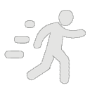

# Quick Start Tutorial



## Open a browser, scene=hello


## Move your camera

| Button | Action | Description |
| ------ | ------ | ----------- |
| {:height="32px" width="32px"} {:height="32px" width="32px"} | **Settings** | Expand/Collapse  |
| {:height="32px" width="32px"} {:height="32px" width="32px"} | **Microphone** | Enable/Disable |
| {:height="32px" width="32px"} {:height="32px" width="32px"} | **Camera** | Enable/Disable |
| {:height="32px" width="32px"} {:height="32px" width="32px"} | **Facial Avatar** | Enable/Disable |
| {:height="32px" width="32px"} {:height="32px" width="32px"} | **Flight** | Enable/Disable |
| {:height="32px" width="32px"} {:height="32px" width="32px"} {:height="32px" width="32px"} | **Movement Speed** | Slow/Medium/Fast |
| {:height="32px" width="32px"} {:height="32px" width="32px"} | **Screenshare** | Enable/Disable |
| {:height="24px" width="24px"} | **Chat Messages** | Open chat messaging |
| {:height="24px" width="24px"} | **User List** | Open list of present users |
| {:height="32px" width="32px"} | **Sign Out** | Exit the ARENA |


## Install arena python library
- [python](python/)

## Run hello world cube, hello.py

```python
import arena
arena.init("arena.andrew.cmu.edu", "realm", "example")
arena.Object(objType=arena.Shape.cube)
arena.handle_events()
```


## Run hello world scene callback, too many msgs

```python
def scene_callback(msg):
    print("scene_callback: ", msg)

arena.init("arena.andrew.cmu.edu", "realm", "example", scene_callback)
```

## Monitor some network connections
- [Network graph](https://arena.andrew.cmu.edu/network/)

## Run hello world click listener callback

```python
def cube_callback(msg):
    print("cube_callback: ", msg)

arena.Object(objType=arena.Shape.cube, clickable=True, callback=cube_callback)
```

## Animate the cube, hello3.py
- [3d-content](3d-content/)
- [gltf-files](3d-content/gltf-files.html)
- [animated-models](3d-content/animated-models.html)


## Use persistance, reload browser
- [persistance](tools/persistance.html)
- [python/examples](python/examples.html)
- [python/definitions](python/definitions.html)

```python
import arena
arena.init("arena.andrew.cmu.edu", "realm", [ a scene name of your own])
arena.Object(objType=arena.Shape.gltf_model,
             location=(-1, 1, -3),
             clickable=True,
             data='{"animation": { "property": "rotation", "to": "0 360 0", "loop": true, "dur": 10000}}',
             url="models/Duck.glb",
             persist=True)
arena.handle_events()
```

## Edit in Scene Builder page, change something
- [Scene builder](https://arena.andrew.cmu.edu/build/)
- [messaging](messaging/)
- [messaging/examples](messaging/examples.html)
- [messaging/definitions](messaging/definitions.html)


## Link your scene to the physical world
- [atlas](tools/atlas.html)
- [atlas](https://atlas.conix.io) (requires write permission)


## Upload python to file store
- [File store](https://arena.andrew.cmu.edu/storemng/) (requires read/write permission)

## Use Builder to add your program runtime

## Debug your program in ARTS
- [ARTS GUI](https://arena.andrew.cmu.edu/arts/)
- [arts](arts/)

## Debug your scene with A-Frame Scene Inspector


## Visual edit/create content with ARB
- [authoring](tools/authoring.html)
