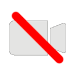

# Quick Start Tutorial

## View the ARENA
To start, open your browser to the scene we will be using in this tutorial. This link will open in a new tab: [https://arena.andrew.cmu.edu/?scene=example](https://arena.andrew.cmu.edu/?scene=example){:target="_blank"}. Since ARENA is a collaborative, multi-user environment, you may see other tutorial learners there. Say Hi! 





## Move around

When you first enter the ARENA, your perspective position in the scene will be at x, y, z coordinates (0, 1.6, 0) which is at the center of the ground plane at about 1.6 meters in the air. Take some time to familiarize yourself with movement and other controls, some of which are listed below. Most importantly:
- **Rotate**: Click and drag the screen.
- **Move**: Arrow keys, or W-A-S-D keys.

| Button | Action | Description |
| ------ | ------ | ----------- |
| {:height="32px" width="32px"} {:height="32px" width="32px"} | **Settings** | Expand/Collapse settings along the right. |
| {:height="32px" width="32px"} {:height="32px" width="32px"} | **Microphone** | Speak into the ARENA, or remain silent. |
| {:height="32px" width="32px"} {:height="32px" width="32px"} | **Camera** | Let your camera show you as a moving box with your camera image on it.  |
| {:height="32px" width="32px"} {:height="32px" width="32px"} | **Facial Avatar** | Let your camera recognize your facial features, and you will appear an animated head matching your facial movement. |
| {:height="32px" width="32px"} {:height="32px" width="32px"} | **Flight** | Movement defaults to walking along the ground, this will enable you to fly up or even down through the ground. |
| {:height="32px" width="32px"} {:height="32px" width="32px"} {:height="32px" width="32px"} | **Movement Speed** | Slow/Medium/Fast, defaults to Medium. |
| {:height="32px" width="32px"} | **Screenshare** | Share your screen as a large panel in the ARENA. |
| {:height="24px" width="24px"} | **Chat Messages** | Open chat messaging. |
| {:height="24px" width="24px"} | **User List** | Open list of present users. |
| {:height="32px" width="32px"} | **Sign Out** | Exit the ARENA. |


## Install arena python library
- [python](python/)



## Create cube and observe

```python
import arena
arena.init("arena.andrew.cmu.edu", "realm", "example")
arena.Object(objType=arena.Shape.cube)
arena.handle_events()
```


## Run scene callback, too many msgs

```python
def scene_callback(msg):
    print("scene_callback: ", msg)

arena.init("arena.andrew.cmu.edu", "realm", "example", scene_callback)
```

## Monitor some network connections
- [Network graph](https://arena.andrew.cmu.edu/network/)

## Run click listener callback

```python
def cube_callback(msg):
    print("cube_callback: ", msg)

arena.Object(objType=arena.Shape.cube, clickable=True, callback=cube_callback)
```

## Animate a GLTF model
- [3d-content](3d-content/)
- [gltf-files](3d-content/gltf-files.html)
- [animated-models](3d-content/animated-models.html)

```python
import arena
arena.init("arena.andrew.cmu.edu", "realm", [a scene name of your own])
arena.Object(objType=arena.Shape.gltf_model,
             objName="duck_1",
             location=(-1, 1, -3),
             clickable=True,
             data='{"animation": { "property": "rotation", "to": "0 360 0", "loop": true, "dur": 10000}}',
             url="models/Duck.glb")
arena.handle_events()
```

Be sure to replace `[a scene name of your own]`.


## Use persistance, reload browser
- [persistance](tools/persistance.html)
- [python/examples](python/examples.html)
- [python/definitions](python/definitions.html)

```json
mosquitto_pub -h arena.andrew.cmu.edu -t realm/s/[a scene name of your own]/duck_1 -m '{ "object_id" : "duck_1", "action": "update", "type": "object", "data": { "animation": { "property": "rotation", "to": "0 360 0", "loop": true, "dur": 10000 } }, "persist": true }'
```

Be sure to replace `[a scene name of your own]`.

Make note of the structure of the `data` element in the above JSON. There are ways to support almost [any A-Frame feature](developer/aframe.html) using arbitrary JSON.

## Try MQTT Messaging Format

## Edit in Scene Builder page, change something
- [Scene builder](https://arena.andrew.cmu.edu/build/)
- [messaging](messaging/)
- [messaging/examples](messaging/examples.html)
- [messaging/definitions](messaging/definitions.html)


## Link your scene to the physical world
- [atlas](tools/atlas.html)
- [atlas](https://atlas.conix.io) (requires write permission)


## Upload python to file store
- [File store](https://arena.andrew.cmu.edu/storemng/) (requires read/write permission)

## Use Builder to add your program runtime

## Debug your program in ARTS
- [ARTS GUI](https://arena.andrew.cmu.edu/arts/)
- [arts](arts/)


## Debug your scene with A-Frame Scene Inspector


## Visual edit/create content with ARB
- [authoring](tools/authoring.html)
