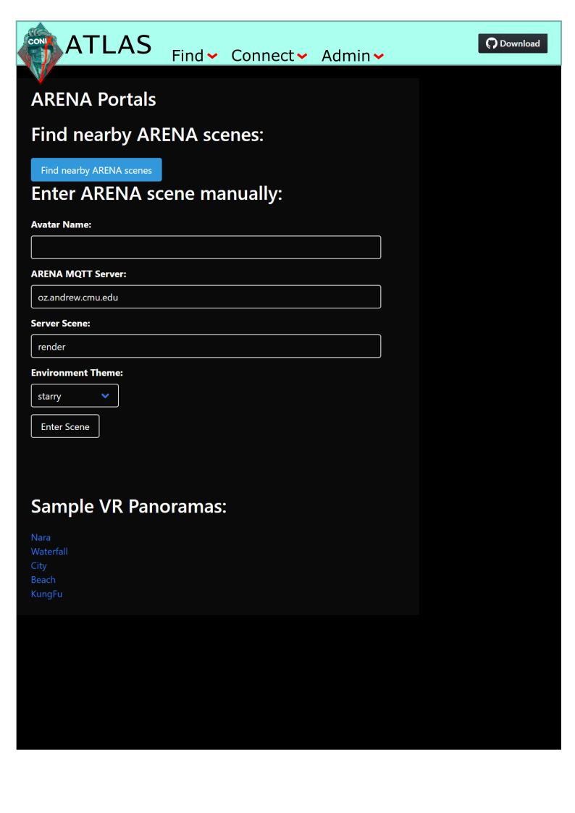

# ATLAS (Authority on The Locations of ARENA Stuff)

- [ATLAS](https://github.com/conix-center/ATLAS) repository

ATLAS will be like an aggregation of maps of major roadways. We intend that by using ATLAS, one can find any ARENA, though the details of scenes and processes we believe will be handled by other systems. The most typical usage of ATLAS would be to find an ARENA near one's own geo-location.

ATLAS is a Sails web app. See `README.md` in `atlas-web-app/` for some more info and links about Sails.

### Populate test data

Currently, I am still populating my own test data each time. Please see [Record.js](https://github.com/conix-center/ATLAS/blob/master/atlas-web-app/api/models/Record.js) for the structure of an ATLAS record. Sails auto-gens a RESTful API from that `Record.js` file. The default routes work fine for us right now, but could use more syntactic suggestions.

- [Sails blueprint-routes](https://sailsjs.com/documentation/concepts/blueprints?blueprint-routes)

For us, with this web app started in dev mode, adding a record via default routes looks like this in a browser navbar:

`localhost:1337/record/create?uuid=deadbeef`

### See test data

Similarly, to see what we just created, we would put the following in the navbar:

`http://localhost:1337/record/`

## The ATLAS-DNS Analogy

ATLAS is to ARENA as DNS is to the Internet

**Well-captured** points of this analogy:

- Both ATLAS and DNS are authorities on critical attributes of networked devices
- Both ATLAS and DNS require manual entry for some subset of ground truth
- Both ATLAS and DNS (well, future versions of ATLAS) are hierarchical, and can be traversed simply via recursion

**Uncaptured** points with the ATLAS-DNS analogy:

- DNS adds 1 layer of abstraction for usability (textual domain name mapped to IP address)
- However, ATLAS is probably going to do much more than a simple 1-to-1 mapping (talk of generating id's, even just performing geospatial calculations to find MQTT servers within _n_ miles is astronomically more compute than DNS)

## Design Decisions

These conclusions we have reached by collaboration and consensus, but are not quite "written in stone" yet.

- ATLAS server will implement a RESTful API (viz. pass documents, not rely on saved server or client state, etc.)
- Luke will write server in Node.js
  - I (Luke) like learning new languages
  - Node.js comes with very handy modules for web server sorts of things
