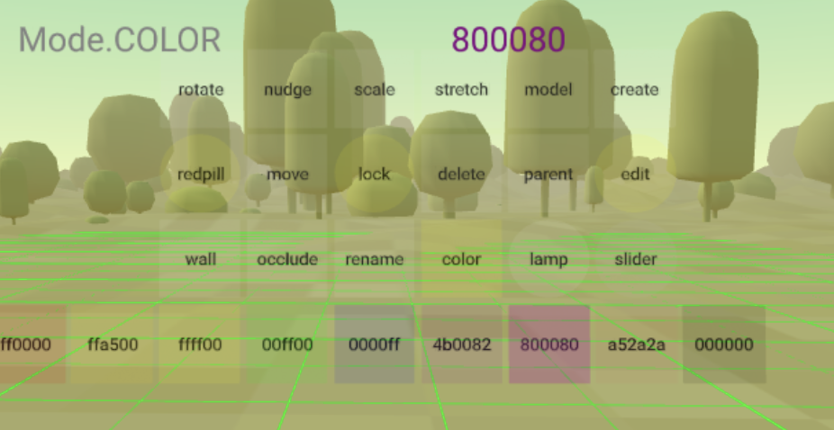

# ARENA AR Builder
An AR/VR capable editing tool to create/manipulate/delete ARENA objects. See top-level Python documentation for [requirements](https://github.com/conix-center/ARENA-py). This tool uses the [ARENA Persistence Database](https://github.com/conix-center/arena-persist), so all changes are persisted.

## Quick Start
1. Clone our Python repo [https://github.com/conix-center/ARENA-py](https://github.com/conix-center/ARENA-py).
1. Usage: `arb` takes at minimum one argument, the first one, a scene name (`hello` in this example).
    ```shell
    cd ARENA-py/tools/arb
    python arb.py hello
    ```
1. Interact with the tool at [https://arena.andrew.cmu.edu?scene=hello](https://arena.andrew.cmu.edu?scene=hello) 

## Demo Video
<figure class="video_container">
  <iframe width="560" height="315" src="https://www.youtube.com/embed/bYantKzkTFk" frameborder="0" allow="accelerometer; autoplay; clipboard-write; encrypted-media; gyroscope; picture-in-picture" allowfullscreen></iframe>
</figure>

## Clickable Objects ONLY
The current version of ARB is only able to interact with existing persisted objects if they have click-handlers implemented (`object.update(clickable=True)`). Clickable objects will turn your cursor from an arrow to a finger pointing as you hover over them. For the time being, anything you create with ARB will have click-handlers implemented automatically.

## Control Panel


- **VR Mode**: Click and hold your mouse to move your camera relative to the panel. 
- **AR Mode**: Move your AR device to move your camera relative to the panel.
- **All Modes**: Use the **lock** button to reposition the panel relative to your camera's rotation. *(in development)*

|Button|Type|Description|
|--|--|--|
|**color**|*action*|Allows color select; tap object to color it *(default=#ffffff)*.|
|**create**|*action*|Allows shape select; tap clipboard object to create it in place *(default=sphere)*.|
|**delete**|*action*|Tap object to delete it.|
|**lamp**|*toggle*|Turns a headlamp on/off.|
|**lock**|*toggle*|Off=panel maintains relative world position; On=panel follows camera rotation. *(in development)*|
|**model**|*action*|Allows GLTF model select; tap clipboard object to create it in place *(default=duck.glb)*. Models may be imported via the **-m** argument *(see below)*.|
|**move**|*action*|Tap an object to show it in the clipboard, tap clipboard object to move it to that place.|
|**nudge**|*action*|Allows mm, cm, dm, m granularity; tap an object to show yellow nudge-lines; tap a positive (red) or negative (blue) ball to nudge the object in that direction according to selected granularity *(default=mm)*. A yellow circle will also show x,z position on the floor (y=0). Nudge-lines expire after 30 seconds of inactivity.|
|**occlude**|*action*|Allows occlusion on/off select; tap object to occlude it *(default=on)*.|
|**parent**|*action*|Allows setting of parent object; first tap the parent object, then tap the child object.|
|**redpill**|*toggle*|Reveals useful debug data: ***gridlines*** on the floor (y=0) can be seen from above and below, ***occlusion mask*** will show all occluded objects, ***object data*** mouse hover on an object will shows its position, rotation, and scale.|
|**rename**|*action*|Allows typing a new name; start typing or just tap an object to load the old name into the editor, then tap the object to apply the new name to.|
|**rotate**|*action*|Allows 1°, 5°, 10°, 45°, 90° Euler angle granularity; tap an object to show orange rotate-lines; tap a positive (red) or negative (blue) ball to change object rotation according to selected granularity *(default=1°)*. Additional 6Dof lines will show degree of rotation. Rotate-lines expire after 30 seconds of inactivity.|
|**scale**|*action*|Allows mm, cm, dm, m granularity; tap an object to show blue scale-lines; tap a positive (red) or negative (blue) ball to increase or decrease object scale according to selected granularity *(default=mm)*. Scale-lines expire after 30 seconds of inactivity.|
|**stretch**|*action*|Allows altering scale in one of 6Dof. *(in development)*|
|**wall**|*action*|Allows creation of a basic wall 0.1m thick; tap clipboard brick once with your AR device flush with one corner of the wall, and tap the second time at the opposing corner. Three alignment markers will appear for 2 minutes. *(in development)*|

## Clipboard

The clipboard is a temporary see-through object floating in front of the user used to show the relative position of placing a future object. It's also used in AR to have something to fire an event at where no object currently exists. 

## Construction Cone

There is a small temporary object resting on position 0,0,0 in the shape of a construction cone to mark the origin of the scene. It will be removed when `arb` stops running.

## Run Options

### Importing Models
You can import a json-formatted manifest of GLTF models using the command argument **-m** to use on the **model** control panel option. You can write your own, or use the example, [arb-manifest.json](https://github.com/conix-center/ARENA-py/blob/master/demos/arb-manifest.json).
```shell
python arb.py hello -m arb-manifest.json
```

Scale varies widely between individual models, so experiment with the best scale to start with.

`arb-manifest.json`
```json
{
    "models": [
        {
            "name": "avocado",
            "url_gltf": "models/Avocado.glb",
            "scale": 5
        },
        {
            "name": "shuttle",
            "url_gltf": "models/Shuttle.glb",
            "scale": 5
        },
        {
            "name": "duck",
            "url_gltf": "models/Duck.glb",
            "scale": 0.2
        },
        {
            "name": "earth",
            "url_gltf": "models/Earth.glb",
            "scale": 2
        },
        {
            "name": "lantern",
            "url_gltf": "models/Lantern.glb",
            "scale": 0.015
        },
        {
            "name": "camera",
            "url_gltf": "models/AntiqueCamera.glb",
            "scale": 0.05
        }
    ]
}
```

### MQTT Host and Realm
By default all `arb` MQTT messages are published to the default message broker and topic (realm and scene you specify) using this scheme: 

- *default broker*: `oz.andrew.cmu.edu`
- *default topic*: `realm/s/hello`

To use your own MQTT message broker (**-b**) and/or realm (**-r**):

- *custom broker*: `arena-west1.conix.io`
- *custom topic*: `foo/s/hello`
```shell
python arb.py hello -b arena-west1.conix.io -r foo
```
