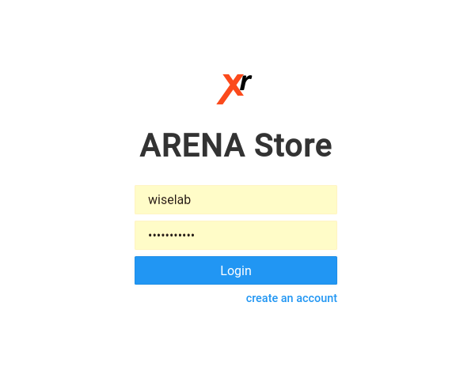
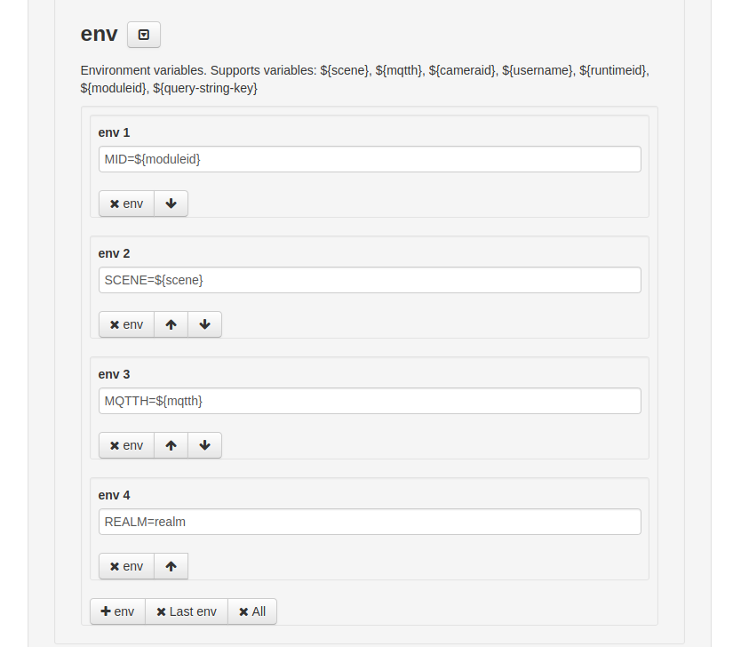

# ARENA File Store



To add models or programs to the ARENA, they will have to be stored somewhere. The [file store](https://arena.andrew.cmu.edu/storemng/) is where most of these files are currently located, and can easily be accessed.

## Uploading Models

After logging into the ARENA file store, there will be options to create a new folder or file on the left of the screen. You can upload entire folders or files, either by clicking the "upload" button on the top right, or dragging them to the page.

Most of the 3D models are stored in the folder "models". To add a 3D model, make sure that it is in `*.GLB/*.GLTF` format, and upload the models. If it is a GLTF in a folder with multiple files, make sure to upload all of it. Keep this in mind when adding the object to a scene, as you will have to specify the GLTF file name within the folder (but not the textures or other components).

## Uploading Programs

To upload a Python or WASM program to the ARENA, follow the same steps as uploading at 3D model. Either create a new file/folder, or upload the files/folders with the programs.

## Additional Notes

Keep in mind the locations of your files, as you will need to know them when trying to add them to the ARENA using [the build page](build).
