# Entering ARENA for the first time

## Signing In

When you first enter the ARENA, there will be a screen asking you to sign in. You can use your Google account, which will automatically set your name to the name used in your Google account (you can change this later). You can also choose to anonymously sign in; you'll have to enter a name to use in the ARENA.

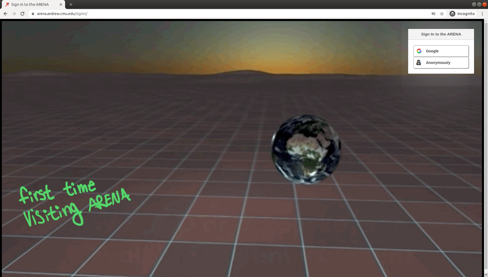

## Permissions

You'll be asked to give location, microphone, and camera access to the ARENA site. If you do not select "yes", you won't be able to use voice, video, or the face tracking avatar.

## Messaging and Users

On the bottom left of the screen, there are two icons.

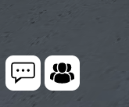

The message icon allows you to send messages to others who are currently online in the ARENA. There is a drop down arrow to choose which scene/user you send the message to. You can send  a message to all scenes, or direct message a user active in the ARENA.

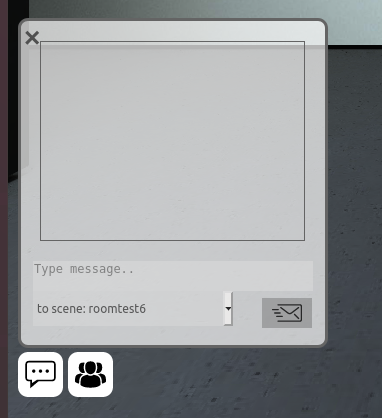

The users icon to the right of the message icon shows the users active, as well as which scene they are in. The top right icon in the users menu allows you to mute all users. The icons next to the users' names allows you to warp to the location of that user.

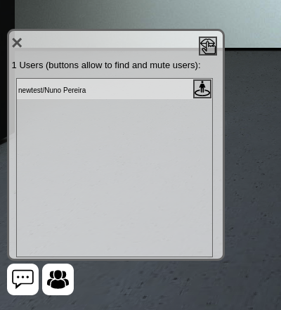

## User Settings

### Movement

When you first enter the ARENA, your perspective position in the scene will be at x, y, z coordinates (0, 1.6, 0) which is at the center of the ground plane at about 1.6 meters in the air. Take some time to familiarize yourself with movement and other controls, some of which are listed below. Most importantly:

- **Rotate**: Left-Right arrow keys, or click and hold to drag the screen.
- **Move**: Forward-Back arrow keys, or W-A-S-D keys.

### Icons

| Button                                                                                                                                                                                                           | Action             | Description                                                                                                         |
| ---------------------------------------------------------------------------------------------------------------------------------------------------------------------------------------------------------------- | ------------------ | ------------------------------------------------------------------------------------------------------------------- |
| {:height="32px" width="32px"} {:height="32px" width="32px"}                                                                                    | **Settings**       | Expand/Collapse settings along the right.                                                                           |
| 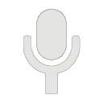{:height="32px" width="32px"} 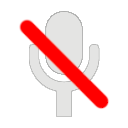{:height="32px" width="32px"}                                                                           | **Microphone**     | Speak into the ARENA, or remain silent.                                                                             |
| 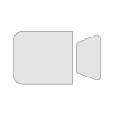{:height="32px" width="32px"} 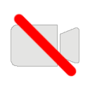{:height="32px" width="32px"}                                                                           | **Camera**         | Let your camera show you as a moving box with your camera image on it.                                              |
| {:height="32px" width="32px"} {:height="32px" width="32px"}                                                                       | **Facial Avatar**  | Let your camera recognize your facial features, and you will appear an animated head matching your facial movement. |
| {:height="32px" width="32px"} 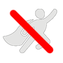{:height="32px" width="32px"}                                                                         | **Flight**         | Movement defaults to walking along the ground, this will enable you to fly up or even down through the ground.      |
| 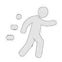{:height="32px" width="32px"} 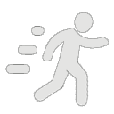{:height="32px" width="32px"} 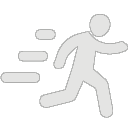{:height="32px" width="32px"} | **Movement Speed** | Slow/Medium/Fast, defaults to Medium.                                                                               |
| 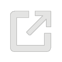{:height="32px" width="32px"}                                                                                                                                              | **Screenshare**    | Share your screen as a large panel in the ARENA.                                                                    |
| 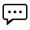{:height="24px" width="24px"}                                                                                                                                                   | **Chat Messages**  | Open chat messaging.                                                                                                |
| {:height="24px" width="24px"}                                                                                                                                              | **User List**      | Open list of present users.                                                                                         |
| 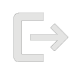{:height="32px" width="32px"}                                                                                                                                                 | **Sign Out**       | Exit the ARENA.                                                                                                     |

### Audio and Video

The icons on the top right of the screen allow you to change aspects of the ARENA experience. The top icon, the microphone, allows you to enable or disable audio sharing in the ARENA. The camera under the microphone allows you to turn on or off your video in the ARENA. If you choose to enable video, your default head icon will change to a cube with your video displayed on each side. You can see a preview of your video in the top left corner when enabled. The face recognition icon is the third icon down, and it cannot be used at the same time as the video cube, but will work with audio. It will use your camera to track your facial features, and show a preview in the top left of the screen. Main features of your facial expression will move on a different face avatar.

### Changing Name

The settings menu is collapsed by default; clicking the arrow underneath the face tracking icon will expand the menu. When clicked, you will see additional icons, as well as your name and authentication options in a pop up next to the icons. It shows the authenticator (Google or anonymous), the email used for Google authentication, and your display name. The display name can be changed here. It is initially set to the name from your Google account or the name chosen when signing in anonymously. If you click the X on the settings box and it disappears, you will need to collapse and re-open the icons to show the options again.

### Speed and Flying

The icon under the face tracking icon (a person with movement lines behind) allows you to change your movement speed. By default, the speed is set to medium. Clicking the speed button once more sets it to fast (running person), and once more will set it to slow (person with no movement lines walking). You can toggle the speed at any time. The icon under the movement speed is the flying icon. By default, it is disabled. If enabled, you can fly around, through the floor or upwards using the WASD or arrow keys. If you disable flying, it will snap you back to the default elevation.

### Screen Sharing

There are several choices here to hold [video conferences and screensharing](../presence/conferencing) in the ARENA. Below the flying icon, there is a monitor icon that allows you to share your screen. This will create a popup asking if you want to continue, and warning that it will open a new tab.

### Sign Out

The icon under the screen share is to sign out of the ARENA. The bottom icon is an arrow to collapse the settings icons.

### VR capabilities

The VR icon in the bottom right will make the ARENA full screen, and can work on a VR headset connected to the computer. Without a headset, it will just show the ARENA in full screen.
