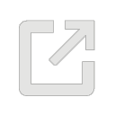

# ARENA User Presence

Users in the ARENA are represented to each other in a 3d scene with an avatar. Your default user avatar looks like a static 3d floating head model with your chosen display name above the head, and a muted microphone icon. Wherever you choose to move or look within a scene is where other users will see your avatar move or look.

## Audio/Video Setup

Upon entering a scene you will see a panel for audio and video setup. Here you can `Select Camera`, `Speakers`, or `Microphone` to use, test your devices to make sure they are working, and adjust your display name.



<!-- TODO: image a/v setup -->

## User Display Name

{:height="32px" width="32px"}
The display name you choose, will be displayed in random colored text above your user avatar. In an ARENA Scene, you can change your display text by clicking the last right-hand arrow "V" icon to show the `Settings` panel, which provides a `Display Name` input box you can change to what you wish.

<!-- TODO: image display name setting -->

## User Video

{:height="32px" width="32px"}
If you click the camera icon, you will begin to send video to other users. The video you are sending to other users will appear in the upper left corner of the screen. If your scene is enabled to use the facial recognition feature, you can click the recognition avatar icon and you will see the facial feature points recognized in the upper left corner of your screen.

| User Avatar                    | Image | Camera | Video Sent                            |
| ------------------------------ | ----- | ------ | ------------------------------------- |
| **Static 3d head** _(default)_ | TBD   | Off    | None                                  |
| **Facial recognition 3d head** | TBD   | On     | No video, only facial feature points  |
| **Video cube**                 | TBD   | On     | Camera video                          |
| **Black cube**                 | TBD   | On     | Camera video error, only black frames |



<!-- TODO: add images of all avatars -->

## User Audio

{:height="32px" width="32px"}
If you click the microphone icon, you will begin to send audio to other users. When you have your microphone turned off, other users will see a muted microphone icon over your avatar. Our audio support includes a number of features. Depending on the range between you and other users' avatars, you may experience louder sounds the closer you are to them, depending which side of you they are speaking from, and if they are far enough away from you to cutoff the audio completely.

| User Audio            | User Range | Microphone | Audio Sent                        |
| --------------------- | ---------- | ---------- | --------------------------------- |
| **Muted Head Icon**   | all        | Off        | None                              |
| **Directional Audio** | 0-20m      | On         | Audio is in stereo by avatar pose |
| **Spatial Audio**     | 0-20m      | On         | Audio fades with distance         |
| **Cutoff Audio**      | > 20m      | On         | None                              |

## User Pose

By default the ARENA shows your location as a 3d model of a head, with your nose at your position coordinates. The **pose** of a user is comprised of the user's **position** (location) and **rotation** (gaze) in the 3d world of the ARENA. Depending on the XR view and hardware you use, your pose may be determined by a number of differing sensors.

<!-- TODO: add images of AR/VR buttons -->

| XR View                              | Rotation Sensor | Position Sensor      |
| ------------------------------------ | --------------- | -------------------- |
| **VR Desktop**                       | Keyboard/Mouse  | Keyboard             |
| **VR Phone/Tablet**                  | Touchscreen     | Touchscreen          |
| **VR Headset/Glasses** _(VR button)_ | Accelerometer   | ---------            |
| **AR Phone/Tablet** _(AR button)_    | Accelerometer   | Accelerometer/Camera |

## Facial Recognition Avatar

{:height="32px" width="32px"}
Your ARENA scene may have the capability to use facial recognition to recognize your facial feature points from your camera and present a generic 3d head which will move its eyes, eyebrows, mouth and lips as you do. Only other users will see the 3d rendering of your avatar.

<figure class="video_container">
  <iframe width="560" height="315" src="https://www.youtube.com/embed/RorgGVWEIdk" frameborder="0" allow="accelerometer; autoplay; clipboard-write; encrypted-media; gyroscope; picture-in-picture" allowfullscreen></iframe>
</figure>

## Screen Sharing

{:height="32px" width="32px"}
When you click and accept the screenshare icon and popup, it will ask for the object name/ID of the object you want to screen share on (defaulted to an object with `object_id`: `screenshare`, which is dynamically created if it doesn't exist already).

- If you choose the name/ID of an already existing object in a scene, it will set the texture of that existing object to be your screen.
- If you choose an object that does not exist in a scene, it will spawn a new screen sharing plane with your chosen `object_id`. This object is not sent through the MQTT bus but is still created for all clients.
- Once you have selected your object name, it will open a new tab that allows you to choose which screen you want to share, and ARENA will automatically place that screen onto the object with an `object_id` you specified.
- You can do whatever you want the object you’re screen sharing on as if it were a normal arena object (change size, shape, attach children, etc). This also applies to the object `screenshare`; it's just a standard ARENA object with `object_id`: `screenshare`!
- When an object is dynamically created with the screen share button, it won't go away after you stop screen sharing. It will only go away if you refresh the page.

## Vive (laser) controls



We've noticed the controllers don't show up in the scene unless they both **and EVERYTHING else for SteamVR** are all working (headset, lighthouses). And sometimes you have to restart SteamVR for hand controllers to show up in the scene; even though SteamVR shows them as being working/on/available/etc. It's possible to open VR mode in an ARENA scene and be missing the hand controls.

By default we use A-Frame `laser-controls` which default to showing Valve Index controller 3D models (gray, circular), even if we are using (equivalent) Vive controllers (black, paddle shaped, not included in the list of controllers known to A-Frame).

## Camera Perspective

(from [A-Frame documentation](https://aframe.io/docs/1.0.0/components/camera.html))

| The camera component defines from which perspective the user views the scene. The camera is commonly paired with controls components that allow input devices to move and rotate the camera.

| A camera should usually be positioned at the average height of human eye level (1.6 meters). When used with controls that receive rotation or position (e.g. from a VR device) this position will be overridden.

```html
<a-entity camera look-controls position="0 1.6 0"></a-entity>
```

The above example puts the camera at a position in the scene, but sure enough, when we use a tablet with WebXRViewer or a VR or AR headset, these values are overwritten. **In fact**, it turns out that from a desktop browser, at the start of our A-Frame session, regardless of the values set in the HTML above, the start position is set to (0, 1.6, 0). It was misleading that the HTML definition just happened to match. Our code sets it to (0,0,0) in the declaration. It gets more interesting: on a tablet or phone, the start position again gets overridden **by (0,0,0) this time!**

| When moving or rotating the camera relative to the scene, use a camera rig. By doing so, the camera’s height offset can be updated by room-scale devices, while still allowing the tracked area to be moved independently around the scene.

```html
<a-entity id="rig" position="25 10 0">
  <a-entity id="camera" camera look-controls></a-entity>
</a-entity>
```
