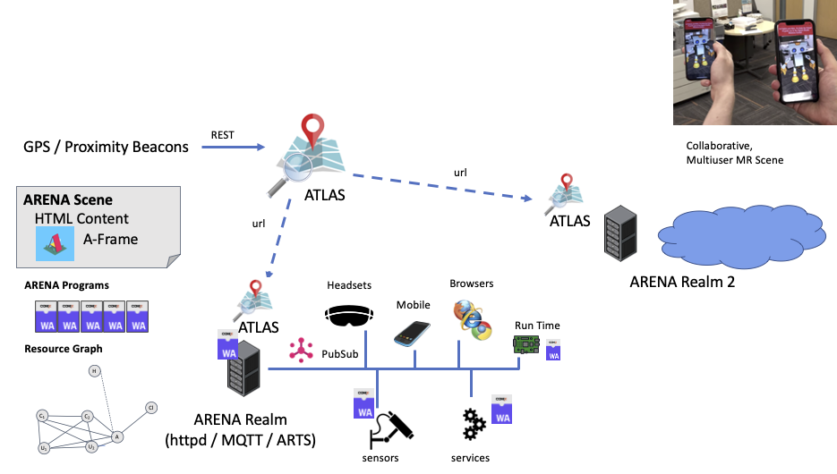
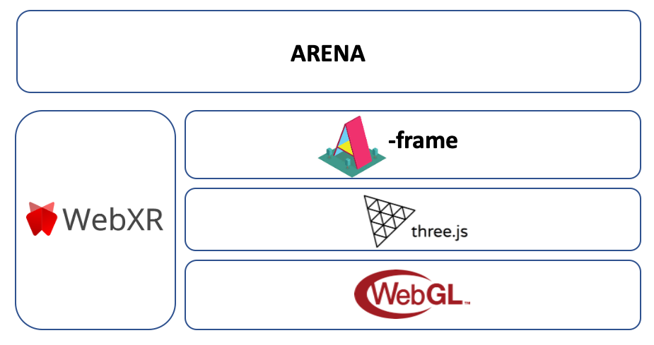

# <u>A</u>ugmented <u>R</u>eality <u>E</u>dge <u>N</u>etwork <u>A</u>rchitecture  - ARENA

## Background

Many have predicted the future of the Web to be the integration of Web content with the real-world through technologies such as augmented reality. This overlay of virtual content on top of the physical world, called the Spatial Web (in different contexts might be called AR Cloud, MetaVerse, Digital Twin), holds promise for dramatically changing the Internet as we see it today, and has broad application. However, building pervasive mixed (virtual and augmented) reality applications is challenging for several reasons, such as: (i) applications require global instant-on localization; (ii) ideally, multiple users should interact with the content; (iii) tight latency requirements; (iv) diversity of compute and interaction capabilities.The Augmented Reality Edge Networking Architecture (ARENA) addresses many of the challenges of building collaborative mixed reality applications. It is designed to allow interactions with and within the physical world, with locality and pervasive sensing as first-class citizens.

## Overview

The ARENA is a network transparent multi-user environment that simplifies the development of mixed reality applications. It allows cross-platform interaction with 3D content that can be generated by any number of network-connected agents (human or machine) in real-time. The system is built on emerging web standards like WebXR with safe and secure runtime support provided by WebAssembly. The ARENA acts like a distributed operating system for environments where you have a tight coupling between physical and virtual assets. It is network transparent in that users and data can execute and migrate seamlessly across any number of connected computing resources that could include edge servers, in-network processing units, or end-user devices like headsets and mobile phones. 

**Figure 1**. ARENA audio and video conferencing (left) and lighting control using pass-through AR on a tablet (right).

The ARENA currently includes a set of demonstrator agents to handle concurrent physics, easy-to-use localization, 3D skeleton capture, and interfaces with a number of commercially available IoT devices. We recently added support for audio and video streaming from laptop cameras and microphones.

## Design

Content viewed by users is composed of 3D scenes (ARENA Scenes) along with the code and other scene information, such as the local message bus server. The scenes are loaded akin to regular web applications within a web browser with the capability to render the content and interact with location services. All objects in the ARENA scene are implicitly networked via a message bus, which allows the scenes, code, and other sensors and services to interact.

**Figure 2**. ARENA Design. Realms represent a geographically distinct set of resources. Each realm has its own set of ARENA services (web server, message bus, runtime manager).

A directory service run by the ATLAS allows users to find the content at their location and supports linking this content with the physical world (by holding information about location beacons, such as light anchors). Execution of code in the scene is managed by a local resource manager (ARTS) and can be dispatched for execution in an available WebAssembly runtime, according to available network and compute resources, quality of service, and security policies. We provide a WebAssembly runtime hosted in any ARENA browser device that can support safely running arbitrary code launched from any other connected target. Currently, we are also working on WebAssembly runtime support outside the browser in both Linux-capable devices and even less capable devices with microcontrollers. 

## Cross Platform Support

A core component of the ARENA is an environment to view and interact in virtual and augmented reality. This environment was built using Web standards (notably, WebXR and WebGL) and frameworks for building 3D scenes and AR/VR environments (three.js and A-Frame). This allows ARENA content to be view on a number of platforms ranging from standard web browsers on desktop computers and VR headsets (desktop browsers, FireFox Reality for VR headsets, Oculus Browser for VR headsets), on phones / tablets with passthrough AR (FireFox WebXR Viewer, Chrome) and wearable AR headsets (Hololens Edge Browser, Magic Leap Lumin Browser). All of these devices can interact in a multi-user manner with a consistent scene. In order to prototype the needs for future browser platforms, we are maintaining a custom WebXR version of Firefox for iOS that is able to perform local image processing as well as 3D click I/O events. We also plan to integrate the ARENA with systems developed to aid coordinating mobile teams (of first responders, firefighters, police) in real-time .

**Figure 3**. ARENA Browser Stack