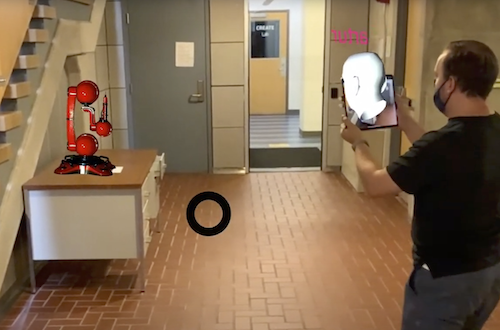
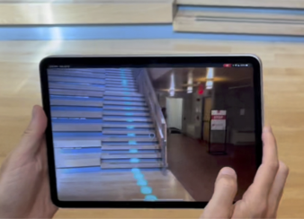
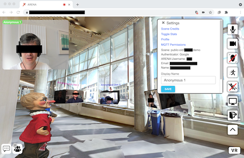
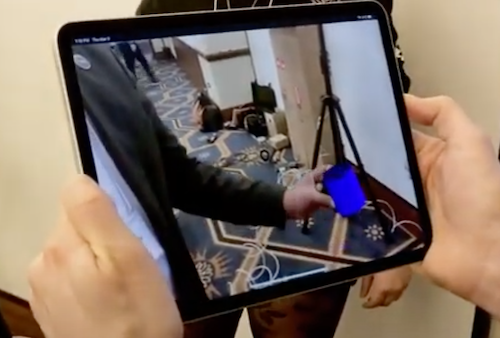

# Collaborative Mixed Reality Applications
{: .fs-9 }

ARENA: a multi-user and multi-application environment to simplify the development of mixed reality applications.
{: .fs-6 .fw-300 }

The <u>A</u>ugmented <u>R</u>eality <u>E</u>dge <u>N</u>etwork <u>A</u>rchitecture (<b>ARENA</b>) is a platform designed to allow interactions with and within the physical world, with locality and pervasive sensing as first-class citizens. ARENA makes it easy to create and host multiple applications that interact with users and other agents in an immersive 3D environment created inside a browser.

| {: style="float: left"} | {: style="float: left"} |
| Industrial robot training | Path markers |
| {: style="float: left"} | {: style="float: left"} |
| VR video conferencing | Overlay of tracked objects |

## Key Features

ARENA simplifies a number of common development tasks for multi-user cross-platform mixed reality programming as follows.

### AR, VR, MR
Seamless support for a spectrum of experiences, from completely immersing the user in a digital world (Virtual Reality) to enhancing the real world with interactive digital content (Augmented Reality). A spectrum currently identified as miXed Reality (XR).

### Multi-platform
Host 3D applications that users can interact with from a number of platforms including tablets, phones, headsets and desktop browsers.  

### Geographic content lookup
The [ATLAS](content/tools/atlas.html) allows to perform geographic queries for content, assets (such as location markers) and compute resources.

### Accurate relocalization
Built-in support for a number of different types of systems (such as UWB, OptiTrack, AprilTags).

### Multiuser Experience
Users in the physical space can see the same 3D content anchored to the physical world in AR, and properties of all objects (and state of users) are networked to provide a consistent real-time view from any device or platform.  

### User Applications
Runtime environment that can host any number of user programs on any network connected device.  

### Security
Fine-grained access control allowing users to share and manage control over content, with user applications hosted by a sandboxed environment.

## Next Steps

 
Get started by following our [ARENA Overview]() to learn the main concepts.
{: .fs-5 .fw-300 }

[   ARENA Overview ](http://example.com/){: .btn .mr-4  .intro-button}

 
Then, you can learn the basics of the interface and [enter ARENA scene for the first time](). Also learn about [creating new scenes](), and how to create [python programs] to define the behavior of your scenes. You can also go for a [system architecture]() deep dive.

[   First Time in the ARENA ](http://example.com/){: .btn .mr-4  .intro-button}
[   Build a Scene ](http://example.com/){: .btn .mr-4 .intro-button}
  
[   Python Programs ](http://example.com/){: .btn .mr-4  .intro-button}
[   Architecture ](http://example.com/){: .btn .mr-4 .intro-button}

The navigation bar on the left side will take you to much more content about the ARENA, which you can browse. Don't forget the search input at the top.

[//]: # ## Video
[//]: # <figure class="video_container">
[//]: #   <iframe width="560" height="315" src="https://www.youtube.com/embed/zNLL9AbruKQ" frameborder="0" allow="accelerometer; autoplay; clipboard-write; encrypted-media; gyroscope; picture-in-picture" allowfullscreen></iframe>
[//]: # </figure>

Icons made by <a href="https://www.flaticon.com/authors/smashicons" title="Smashicons">Smashicons</a>, <a href="https://www.freepik.com" title="Freepik">Freepik</a> from <a href="https://www.flaticon.com/" title="Flaticon">www.flaticon.com</a>

